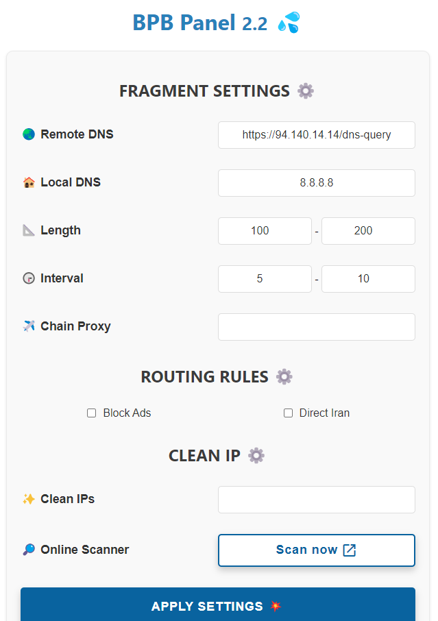

<h1 align="center">💦 BPB Panel</h1>

#### 🌏 Readme in [Farsi](README_fa.md)

  

  

## Introduction
This project is dedicated to developing a user panel for the [Cloudflare-workers/pages proxy script](https://github.com/yonggekkk/Cloudflare-workers-pages-vless) created by [yonggekkk](https://github.com/yonggekkk). The panel offers two deployment options: 
- Option 1: Worker deployment
- Option 2: Pages deployment

---

## Features

1. **Free**: No cost involved.
2. **User-Friendly Panel:** Designed for easy navigation, configuration and usage.
3. **Support Fragment:** Provides support for fragment functionality.
5. **Ad Blocking (Optional):** Option to block Ads.
6. **Direct Iran (Optional):** Includes an option for direct access to Iran.
7. **Full routing rules:** Bypassing Iran, Blocking Ads, Malwares, Phishing... for Sing-box.
8. **Chain Proxy:** Capable of adding a chain proxy to fix IP.
9. **Supports Wide Range of Clients:** Offers subscription links.
10. **Subscription Link (JSON):** Provides subscription link for JSON configs.
11. **Singbox:** Features Singbox integration.
12. **Password-Protected Panel:** Secure your panel with password protection.
13. **Custom Cloudflare Clean IP:** Ability to use online scanner and setting up clean IP-domains.

---

## How to use:
[Installation (Pages)](docs/pages_installation_fa.md)

[Installation (Worker)](docs/worker_installation_fa.md)

[how to use](docs/configuration_fa.md)

[Troubleshooting](docs/troubleshooting.md)

[FAQ](docs/faq.md)

---

## Stargazers Over Time

---

### Special Thanks
- CF-vless code author [3Kmfi6HP](https://github.com/3Kmfi6HP/EDtunnel)
- CF preferred IP program author [badafans](https://github.com/badafans/Cloudflare-IP-SpeedTest), [XIU2](https://github.com/XIU2/CloudflareSpeedTest)

---

For a detailed tutorial on the core script, please refer to [Yongge’s blog and video tutorials](https://ygkkk.blogspot.com/2023/07/cfworkers-vless.html).
