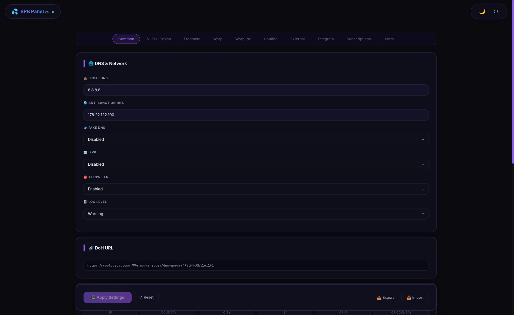

<h1 align="center">BPB Panel</h1>

### 🌏 Readme in [Farsi](README_fa.md)

<p align="center">
  
</p>
<br>

## Introduction

This project is aimed to provide a user panel to access FREE, SECURE, PRIVATE proxies and tools including **VLESS**, **Trojan** and **Warp** configs alongside a **private DoH** server for cross-platform clients. It ensures connectivity even when domains or Warp services are blocked by ISPs, offering **Workers** and **Pages** deployments using [BPB Wizard](https://github.com/bia-pain-bache/BPB-Wizard) in a few seconds!

🌟 If you found **BPB Panel** valuable, Your donations make all the difference 🌟

### USDT (BEP20)

```text
0xbdf15d41C56f861f25b2b11C835bd45dfD5b792F
```

## Features

1. **Free and Private**: No costs involved and the server is private.
2. **Intuitive Panel:** Streamlined for effortless navigation, configuration and use.
3. **Versatile Protocols:** Provides VLESS, Trojan and Wireguard (Cloudflare Warp) protocols.
4. **Private DoH:** A ready to use DoH server, capable of customizing underlying DNS server.
5. **Warp Pro configs:** Optimized Warp for crucial circumstances.
6. **Fragment support:** Supports Fragment functionality for crucial network situations.
7. **Comprehensive Routing Rules:** Bypassing Iran/China/Russia, Blocking QUIC, Porn, Ads, Malwares, Phishing and also bypassing sanctions.
8. **Chain Proxy:** Capable of adding a chain proxy (VLESS, Trojan, Shadowsocks, socks and http) to fix IP.
9. **Broad client compatibility:** Offers subscription links for Xray, Sing-box and Clash-Mihomo core cross-platform clients.
10. **Password-protected panel:** Provides secure and private panel with full authentication.
11. **Fully customizable:** Supports setting up clean IPs-domains, Proxy IPs, DNS servers, choosing ports and protocols, Warp endpoints and more.
12. **Node ability:** Can share settings and proxies across other BPB users.
13. **Proxy aggregation:** Supports aggregating another proxies into BPB proxies and deliver in a single subscription.

## Limitations

1. **UDP transport**: VLESS and Trojan protocols on workers do not handle **UDP** properly, so it is disabled by default (affecting features like Telegram video calls), UDP DNS is also unsupported. DoH is enabled by default for enhanced security.
2. **Request limit**: each worker supports 100K requests per day for VLESS and Trojan, suitable for 2-3 users. You can use limitless Warp configs.

## Getting started

- [Installation methods](https://bia-pain-bache.github.io/BPB-Worker-Panel/wizard/)
- [Configuration](https://bia-pain-bache.github.io/BPB-Worker-Panel/configuration/)
- [How to use](https://bia-pain-bache.github.io/BPB-Worker-Panel/usage/)
- [FAQ](https://bia-pain-bache.github.io/BPB-Worker-Panel/faq/)

## Supported Clients

|       Client        | Minimum version |  Fragment support  |  Warp Pro support  |
| :-----------------: | :-------------: | :----------------: | :----------------: |
|     **v2rayNG**     |      2.2.3      | :heavy_check_mark: | :heavy_check_mark: |
|     **MahsaNG**     |       16        | :heavy_check_mark: | :heavy_check_mark: |
|     **v2rayN**      |     7.22.5      | :heavy_check_mark: | :heavy_check_mark: |
|    **Streisand**    |     1.6.71      | :heavy_check_mark: | :heavy_check_mark: |
|    **Sing-box**     |     1.12.0      | :heavy_check_mark: |        :x:         |
|      **husi**       |      1.3.2      | :heavy_check_mark: |        :x:         |
|   **Clash Meta**    |                 |        :x:         | :heavy_check_mark: |
| **Clash Verge Rev** |                 |        :x:         | :heavy_check_mark: |
|     **FLClash**     |                 |        :x:         | :heavy_check_mark: |
|    **Wireguard**    |                 |        :x:         |        :x:         |
|   **AmneziaVPN**    |                 |        :x:         | :heavy_check_mark: |
|    **WG Tunnel**    |                 |        :x:         | :heavy_check_mark: |

---

### Special Thanks

- VLESS, Trojan [Cloudflare-workers/pages proxy script](https://github.com/yonggekkk/Cloudflare-workers-pages-vless) by [yonggekkk](https://github.com/yonggekkk)
- CF-vless code author [3Kmfi6HP](https://github.com/3Kmfi6HP/EDtunnel)
- CF preferred IP program author [badafans](https://github.com/badafans/Cloudflare-IP-SpeedTest), [XIU2](https://github.com/XIU2/CloudflareSpeedTest)
