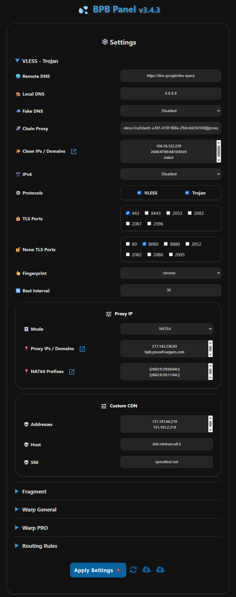

<h1 align="center">BPB Panel</h1>

### 🌏 Readme in [Farsi](README_fa.md)

  

 

## Environment variables

|   Variable   |               Usage                |     Mandatory      |
| :----------: | :--------------------------------: | :----------------: |
|   **UUID**   |             VLESS UUID             | :heavy_check_mark: |
| **TR_PASS**  |          Trojan Password           | :heavy_check_mark: |
| **PROXY_IP** | Proxy IP or domain (VLESS, Trojan) |        :x:         |
|  **PREFIX**  |   NAT64 Prefixes (VLESS, Trojan)   |        :x:         |
| **SUB_PATH** |         Subscriptions' URI         |        :x:         |
| **FALLBACK** |  Fallback domain (VLESS, Trojan)   |        :x:         |
| **DOH_URL**  |              Core DOH              |        :x:         |

---

## Stargazers Over Time

---

### Special Thanks

- VLESS, Trojan [Cloudflare-workers/pages proxy script](https://github.com/yonggekkk/Cloudflare-workers-pages-vless) created by [yonggekkk](https://github.com/yonggekkk)
- CF-vless code author [3Kmfi6HP](https://github.com/3Kmfi6HP/EDtunnel)
- CF preferred IP program author [badafans](https://github.com/badafans/Cloudflare-IP-SpeedTest), [XIU2](https://github.com/XIU2/CloudflareSpeedTest)
