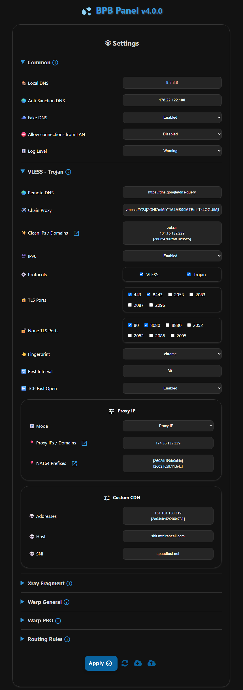

<h1 align="center">💦 پنل BPB</h1> 

#### 🌏 [English](README.md)

<p align="center">
  
</p>
<br>

## معرفی

این پروژه یه پنل کاربری برای دسترسی به کانفیگ‌های رایگان، امن و خصوصی **VLESS**، **Trojan** و **Warp** ارائه می‌ده. حتی وقتی دامنه‌ها یا سرویس Warp توسط اپراتورها فیلتر شدن، اتصال رو تضمین می‌کنه. این پنل به دو روش راه‌اندازی می‌شه:

* با **Cloudflare Workers**
* با **Cloudflare Pages**

🌟 اگه **پنل BPB** براتون مفید بوده، با حمایتتون بهم دلگرمی می‌دید 🌟

### USDT (BEP20)

```text
0xbdf15d41C56f861f25b2b11C835bd45dfD5b792F
```

## ویژگی‌ها

* **رایگان و شخصی**:  بدون هیچ هزینه‌ای، سرور شما شخصی هست.
* **پنل کاربری ساده**: کار باهاش راحته و تنظیمات و استفاده ازش خیلی آسونه.
* **پروتکل‌های متنوع**: ارائه کانفیگ‌های VLESS، Trojan و Wireguard (Warp).
* **کانفیگ‌های Warp Pro**: کانفیگ‌های Warp بهینه‌شده برای شرایط خاص ایران.
* **پشتیبانی از Fragment**: اتصال حتی در صورت فیلتر شدن دامنه.
* **قوانین مسیریابی کامل**: دور زدن سایت‌های ایرانی، چینی، روسی و LAN، مسدود کردن QUIC، محتوای پورن، تبلیغات، بدافزارها، فیشینگ و در زدن سایت‌های تحریمی.
* **زنجیره‌ی Proxy**: می‌تونید یه Proxy زنجیره‌ای اضافه کنید تا IP ثابت بشه.
* **پشتیبانی از برنامه‌های مختلف**: لینک‌های اشتراک برای برنامه‌های با هسته‌های Xray، Sing-box و Clash-Mihomo.
* **پنل امن با رمز عبور**: پنل محافظت شده با رمز عبور.
* **سفارشی‌سازی کامل**: تنظیم IP تمیز، Proxy IP، سرورهای DNS، انتخاب پورت‌ها و پروتکل‌ها، Warp Endpoint و خیلی امکانات دیگه.

## محدودیت‌ها

* **اتصال UDP**: پروتکل‌های VLESS و Trojan روی Workerها نمی‌تونن UDP رو به‌خوبی پشتیبانی کنن، برای همین به‌صورت پیش‌فرض غیرفعاله (این روی امکاناتی مثل تماس تصویری تلگرام تأثیر می‌ذاره). DNSهای UDP هم پشتیبانی نمی‌شن. به جاش DoH فعاله که امن‌تره.
* **محدودیت تعداد درخواست**: هر Worker برای VLESS و Trojan روزانه 100 هزار درخواست پشتیبانی می‌کنه، که برای 2-3 نفر کافیه. برای اتصال نامحدود می‌تونید از دامنه شخصی (برای VLESS/Trojan با روش Workers) یا کانفیگ‌های Warp استفاده کنید.

## شروع به کار

* [روش‌های راه‌اندازی](https://bia-pain-bache.github.io/BPB-Worker-Panel/fa/installation/wizard/)
* [راهنمای تنظیمات](https://bia-pain-bache.github.io/BPB-Worker-Panel/fa/configuration/)
* [نحوه‌ی استفاده](https://bia-pain-bache.github.io/BPB-Worker-Panel/fa/usage/)
* [پرسش‌های متداول (FAQ)](https://bia-pain-bache.github.io/BPB-Worker-Panel/en/faq/)

## برنامه‌های پشتیبانی شده
<div dir="rtl">
<table>
  <thead>
    <th>برنامه</th>
    <th>نسخه</th>
    <th>Fragment</th>
    <th>Warp Pro</th>
  </thead>
  <tbody  align="center">
    <tr>
      <td><b>v2rayNG</b></td>
      <td>1.10.2 و بالاتر</td>
      <td>✔️</td>
      <td>✔️</td>
    </tr>
    <tr>
      <td><b>v2rayN</b></td>
      <td>7.12.5 و بالاتر</td>
      <td>✔️</td>
      <td>✔️</td>
    </tr>
    <tr>
      <td><b>v2rayN-Pro</b></td>
      <td>1.9 و بالاتر</td>
      <td>✔️</td>
      <td>✔️</td>
    </tr>
    <tr>
      <td><b>Husi</b></td>
      <td></td>
      <td>❌</td>
      <td>❌</td>
    </tr>
    <tr>
      <td><b>Sing-box</b></td>
      <td>1.12.0 و بالاتر</td>
      <td>✔️</td>
      <td>❌</td>
    </tr>
    <tr>
      <td><b>Streisand</b></td>
      <td>1.6.48 و بالاتر</td>
      <td>✔️</td>
      <td>✔️</td>
    </tr>
    <tr>
      <td><b>V2Box</b></td>
      <td></td>
      <td>❌</td>
      <td>❌</td>
    </tr>
    <tr>
      <td><b>Shadowrocket</b></td>
      <td></td>
      <td>❌</td>
      <td>❌</td>
    </tr>
    <tr>
      <td><b>Nekoray</b></td>
      <td></td>
      <td>✔️</td>
      <td>❌</td>
    </tr>
    <tr>
      <td><b>Hiddify</b></td>
      <td>2.0.5 و بالاتر</td>
      <td>✔️</td>
      <td>✔️</td>
    </tr>
    <tr>
      <td><b>MahsaNG</b></td>
      <td>13 و بالاتر</td>
      <td>✔️</td>
      <td>✔️</td>
    </tr>
    <tr>
      <td><b>Clash Meta</b></td>
      <td></td>
      <td>❌</td>
      <td>❌</td>
    </tr>
    <tr>
      <td><b>Clash Verg Rev</b></td>
      <td></td>
      <td>❌</td>
      <td>❌</td>
    </tr>
    <tr>
      <td><b>FLClash</b></td>
      <td></td>
      <td>❌</td>
      <td>❌</td>
    </tr>
    <tr>
      <td><b>AmneziaVPN</b></td>
      <td></td>
      <td>❌</td>
      <td>✔️</td>
    </tr>
    <tr>
      <td><b>WG Tunnel</b></td>
      <td></td>
      <td>❌</td>
      <td>✔️</td>
    </tr>
  </tbody>
</table>
</div>

## متغیرهای محیطی (داشبورد کلادفلر)
<div dir="rtl">
<table>
  <thead>
    <th>متغیر</th>
    <th>کاربرد</th>
  </thead>
  <tbody  align="center">
    <tr>
      <td><b>UUID</b></td>
      <td>UUID برای پروتکل VLESS</td>
    </tr>
    <tr>
      <td><b>TR_PASS</b></td>
      <td>پسورد پروتکل Trojan</td>
    </tr>
    <tr>
      <td><b>PROXY_IP</b></td>
      <td>Proxy IP برای VLESS و Trojan</td>
    </tr>
    <tr>
      <td><b>PREFIX</b></td>
      <td>NAT64 Prefix برای VLESS و Trojan</td>
    </tr>
    <tr>
      <td><b>SUB_PATH</b></td>
      <td>مسیر لینک‌های اشتراک شخصی</td>
    </tr>
    <tr>
      <td><b>FALLBACK</b></td>
      <td>دامنه‌ی پوششی برای VLESS و Trojan</td>
    </tr>
    <tr>
      <td><b>DOH_URL</b></td>
      <td>DOH برای عملیات داخلی ورکر</td>
    </tr>
  </tbody>
</table>
</div>

---
## تعداد ستاره‌ها به مرور زمان

[](https://starchart.cc/bia-pain-bache/BPB-Worker-Panel)

---
### تشکر ویژه

- نویسنده پروتکل‌های VLESS و Trojan <a href="https://github.com/yonggekkk/Cloudflare-workers-pages-vless">پروکسی Cloudflare-workers/pages</a>
- نویسنده کد CF-vless <a href="https://github.com/3Kmfi6HP/EDtunnel">3Kmfi6HP</a>
- نویسنده برنامه IP ترجیحی CF <a href="https://github.com/badafans/Cloudflare-IP-SpeedTest">badafans</a>، <a href="https://github.com/XIU2/CloudflareSpeedTest">XIU2</a>
