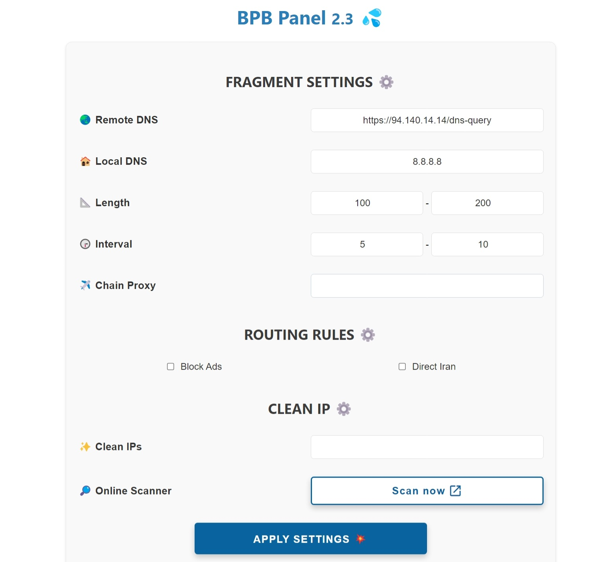

<h1 align="center">💦 پنل BPB</h1>

#### 🌏 [English](README.md)

  

 

## معرفی

این پروژه توسعه‌ی یک پنل کاربری برای اسکریپت <a href="https://github.com/yonggekkk/Cloudflare-workers-pages-vless">پروکسی Cloudflare-workers/pages</a> ایجاد شده توسط <a href="https://github.com/yonggekkk">yonggekkk</a> می‌باشد.

### این پنل به دو روش راه‌اندازی می‌شود:

- راه‌اندازی با **Cloudflare Worker**
- راه‌اندازی با **Cloudflare Worker**
 

🌟 اگر پروژه‌ی **BPB Panel** براتون مفید بوده، حمایت شما مایه‌ی دلگرمی من هست 🌟
<ul dir="rtl">
  <li><code>0x111EFF917E7cf4b0BfC99Edffd8F1AbC2b23d158</code> <strong>:USDT (BEP20)</strong></li>
</ul>

## ویژگی‌ها
 
<ol dir="rtl">
  <li><strong>رایگان</strong></li>
  <li><strong>پنل کاربری راحت:</strong> قابلیت آسان تنظیمات و دریافت کانفیگ ها و لینک های اشتراک.</li>
  <li><strong>پروتکل‌های متنوع:</strong> ارائه کانفیگ‌های VLESS، Trojan و Warp.</li>
  <li><strong>سابسکریپشن Warp Pro: </strong>ارائه‌ی کانفیگ‌های وارپ بهینه شده برای شرایط همیشه خاص ایران</li>
  <li><strong>پشتیبانی از فرگمنت:</strong> قابل استفاده حتی در صورت فیلتر شدن دامنه.</li>
  <li><strong>قوانین مسیریابی کامل:</strong> شامل دور زدن سایت‌های ایرانی و چینی، روسی و دسترسی مستقیم به LAN، مسدودسازی تبلیغات ایرانی و خارجی و پورن و پروتکل QUIC</li>
  <li><strong>زنجیره‌ی Proxy:</strong> قابلیت اضافه کردن Proxy خروجی جهت تثبیت IP.</li>
  <li><strong>پشتیبانی از طیف وسیعی از برنامه‌ها:</strong> لینک‌های اشتراک را برای انواع نرم افزار ها با هسته‌های Xray و Sing-box و Clash ارائه میدهد.</li>
  <li><strong>پنل با رمز عبور محافظت شده:</strong> ایمن‌سازی پنل با استفاده از رمز عبور.</li>
  <li><strong>سفارشی‌سازی کامل تنظیمات:</strong> قابلیت اسکن و تنظیم IP تمیز، Proxy IP، DNS سرورها، پورت‌ها، پروتکل‌ها و Warp endpoint و ...</li>
</ol>
  

## نحوه‌ی راه‌اندازی، تنظیمات و استفاده
- [روش جدید پیشنهادی نصب به صورت Pages](docs/pages_upload_installation_fa.md)
- [نصب به صورت Pages](docs/pages_installation_fa.md)
- [نصب به صورت Workers](docs/worker_installation_fa.md)
- [نحوه استفاده از پنل](docs/configuration_fa.md)
- [پرسش‌های متداول (FAQ)](docs/faq.md)
 

## برنامه‌های پشتیبانی شده

<table>
  <thead>
    <th>برنامه</th>
    <th>نسخه</th>
    <th>Fragment</th>
    <th>Warp Pro</th>
  </thead>
  <tbody  align="center">
    <tr>
      <td><b>v2rayNG</b></td>
      <td>1.8.19 و بالاتر</td>
      <td>✔️</td>
      <td>❌</td>
    </tr>
    <tr>
      <td><b>v2rayN</b></td>
      <td>6.42 و بالاتر</td>
      <td>✔️</td>
      <td>❌</td>
    </tr>
    <tr>
      <td><b>v2rayN-Pro</b></td>
      <td>1.4 و بالاتر</td>
      <td>✔️</td>
      <td>✔️</td>
    </tr>
    <tr>
      <td><b>Nekobox</b></td>
      <td></td>
      <td>❌</td>
      <td>❌</td>
    </tr>
    <tr>
      <td><b>Sing-box</b></td>
      <td>1.10.1 و بالاتر</td>
      <td>❌</td>
      <td>❌</td>
    </tr>
    <tr>
      <td><b>Streisand</b></td>
      <td></td>
      <td>✔️</td>
      <td>❌</td>
    </tr>
    <tr>
      <td><b>V2Box</b></td>
      <td></td>
      <td>❌</td>
      <td>❌</td>
    </tr>
    <tr>
      <td><b>Shadowrocket</b></td>
      <td></td>
      <td>❌</td>
      <td>❌</td>
    </tr>
    <tr>
      <td><b>Nekoray</b></td>
      <td></td>
      <td>✔️</td>
      <td>❌</td>
    </tr>
    <tr>
      <td><b>Hiddify</b></td>
      <td>2.0.5 و بالاتر</td>
      <td>❌</td>
      <td>✔️</td>
    </tr>
    <tr>
      <td><b>NikaNG</b></td>
      <td></td>
      <td>✔️</td>
      <td>✔️</td>
    </tr>
    <tr>
      <td><b>Clash Meta</b></td>
      <td></td>
      <td>❌</td>
      <td>❌</td>
    </tr>
    <tr>
      <td><b>Clash Verg Rev</b></td>
      <td></td>
      <td>❌</td>
      <td>❌</td>
    </tr>
    <tr>
      <td><b>FLClash</b></td>
      <td></td>
      <td>❌</td>
      <td>❌</td>
    </tr>
  </tbody>
</table>

---
## تعداد ستاره‌ها به مرور زمان

---
### تشکر ویژه

- نویسنده کد CF-vless <a href="https://github.com/3Kmfi6HP/EDtunnel">3Kmfi6HP</a>
- نویسنده برنامه IP ترجیحی CF <a href="https://github.com/badafans/Cloudflare-IP-SpeedTest">badafans</a>، <a href="https://github.com/XIU2/CloudflareSpeedTest">XIU2</a>

---
برای آموزش جزئیات اسکریپت اصلی، لطفاً به <a href="https://ygkkk.blogspot.com/2023/07/cfworkers-vless.html">وبلاگ و آموزش‌های ویدیویی Yongge</a> مراجعه کنید.
