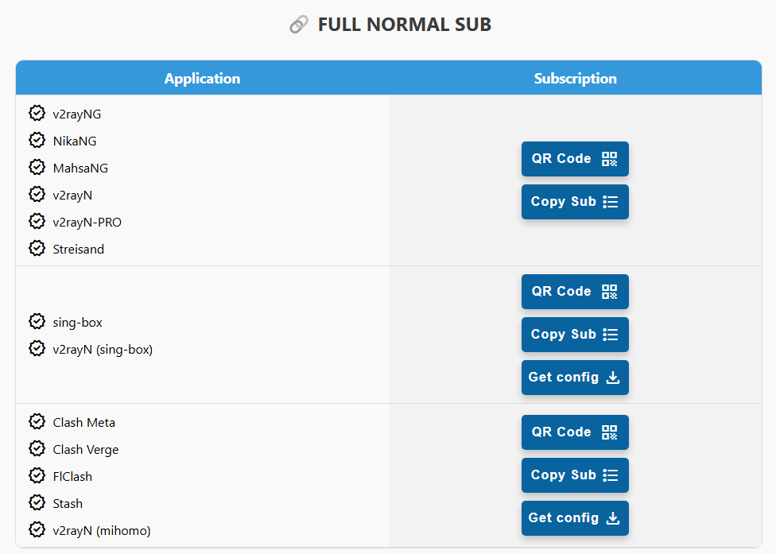
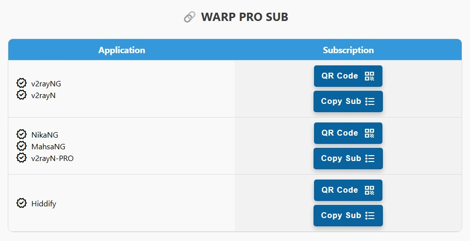
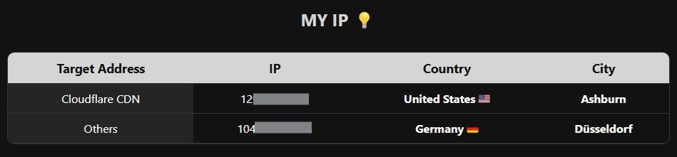
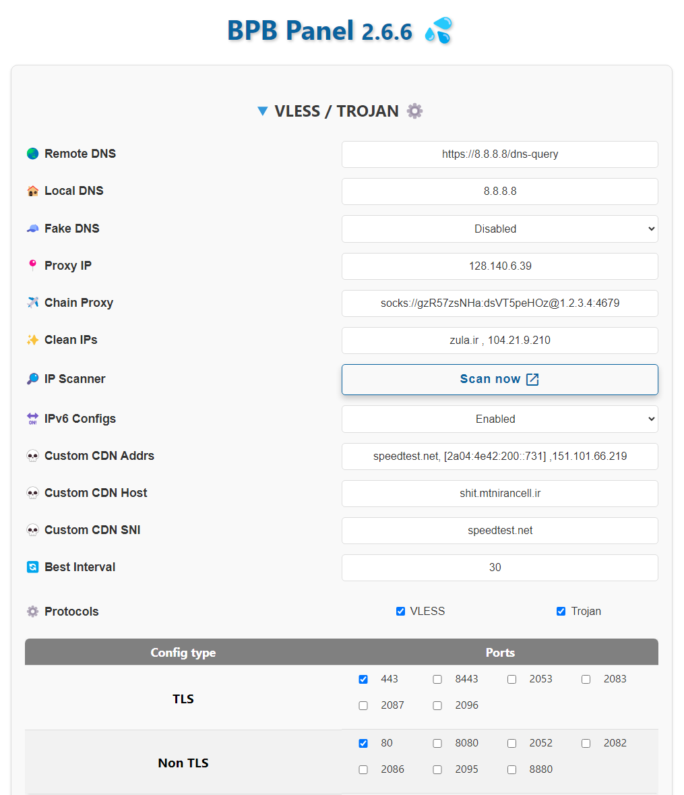

<h1 align="center">如何使用和设置</h1>

假设您的 worker 或 pages 名称是 `worker-polished-leaf-d022`：

您可以通过在末尾添加 `panel/` 来查看面板，如下所示：

>`https://worker-polished-leaf-d022.workers.dev/panel`

系统会要求您设置新密码并登录，完成即可。
> [!IMPORTANT]
> 密码必须至少 **8 个字符**，并且至少包含一个 **大写字母** 和一个 **数字**。以后您可以在面板底部更改密码。
现在让我们来看看面板的不同部分：
  

# 1 - Normal 订阅

  

我从这一部分开始，因为很多人希望使用没有 fragment 或面板设置的配置，但请注意，您必须自己知道如何在应用程序上进行设置，否则可能会遇到问题。我建议使用 `Full Normal` 订阅，因为所有面板设置都已应用，无需特别操作。请注意，Routing Rules 或 Chain Proxy 和面板的 DNS 设置不会应用于此订阅（必须手动在程序中设置）。
这个链接提供 6 个配置。（您可以通过 IP、清洁和端口、协议设置来增加配置数量）那么这 6 个配置有什么区别呢？

- **Websocket Path 配置路径：** 每个配置都有不同的路径。
- **配置地址：** 这 6 个配置中的第一个是您自己的 worker 域名，第二个是 www.speedtest.net 的地址，通常在大多数运营商上是干净的，3 到 6 也是您自己域名的 IP，这些通常也是干净的。两个 IPv4 和两个 IPv6。

那么如何增加它们的数量呢？更多的说明和设置在 [添加清洁 IP](#1-4--设置-ip-清洁) 和 [添加端口](#1-9--选择-port) , [选择协议](#1-8--选择-protocol) 和 [添加自定义 CDN](#1-6--设置-custom-cdn) 部分进行了说明。
> [!CAUTION]
> 使用此订阅时，请在您使用的每个应用程序的设置中关闭 Mux。

> [!WARNING]
> 使用此 Worker 时，您的设备 IP 会不断变化，因此在进行交易、PayPal 和一些敏感网站（如 Hetzner）时，请勿使用，可能会被封禁。关于固定 IP，我们提供了两种解决方案，一种是 [设置 Proxy IP](#1-2--设置-proxy-ip) 在启动时，另一种是 [使用 Chain Proxy](#1-3--设置-chain-proxy)。
  

# 2 - Full Normal 订阅

  

此订阅提供上述配置的功能，唯一的区别是所有 VLESS / Trojan 面板设置都已应用，您可以 [在这里](#1--设置-vlesstrojan) 学习。此外，这些订阅具有 **Best Ping** 配置（后续说明）。通过应用路由设置，可以阻止约 90% 的国内外广告，绕过中国和伊朗网站（无需关闭 VPN 进行支付等），绕过 LAN，阻止色情和 QUIC，同时 Sing-box 订阅可以很好地阻止钓鱼和恶意软件内容。
> [!TIP]
> **Best Ping** 配置是什么？此配置将所有面板配置合并，每 30 秒检查哪个配置速度更快并连接到它！如果您输入了干净的 IP 或启用了 Trojan 协议或选择了其他端口，它也会添加到 Best Ping 中。我们在后续的 Fragment 和 Warp 订阅中也有这种类型的配置。
  

# 3 - Fragment 订阅

  

> [!NOTE]
> **Fragment 配置的特性**
> 
> 1- 即使在个人域名或 worker 被过滤的情况下也能连接。
> 
> 2- 在所有运营商上，尤其是那些在 Cloudflare 上有干扰的运营商，改善质量和速度。

 

## 3-1 - Xray 的 Fragment 订阅

指的是使用 Xray 内核的程序，实际上是面板中 FRAGMENT SUB 表格的第一行，输入到应用程序中与普通订阅相同。此部分的配置名称中带有 `F`。

此订阅提供与 Full Normal 订阅相同数量的配置，带有 Fragment（根据您在面板中应用的 Fragment 设置），并附加 **Best Fragment** 和 **Workerless** 配置。您在面板中进行的任何设置在更新订阅时都会应用到所有配置上。

> [!TIP]
> WorkerLess 配置可以打开许多被过滤的网站和应用程序！例如 YouTube、Twitter、Google Play 和其他被过滤的网站。请注意，由于此配置不使用 worker，因此不会更改您的 IP，因此不适合用于安全工作。您在面板中对 Fragment 的更改也会应用于此配置，除了 Chain Proxy。

> [!TIP]
> Best Fragment 配置会应用 18 种不同的 Fragment，并根据您的运营商选择速度更快的配置！这 18 种状态的选择方式确保没有遗漏，并且配置会每分钟测试所有小范围和大范围的状态并连接到最佳状态。
有关 Fragment 的高级设置，请参见 [这里](#4-2--设置-fragment)。
  

## 3-2 - Hiddify 的 Fragment 订阅

FRAGMENT SUB 表格的第二行用于在 Hiddify 程序上使用 Fragment，唯一的区别是，由于此程序的限制，许多面板设置不会应用于此订阅，实际上程序会重写这些设置。此部分的配置名称中带有 `F`。以下设置必须手动在 Hiddify 程序中应用，目前无法通过面板应用：

 1. 远程 DNS
 2. 本地 DNS
 3. Fragment 数据包
 4. 路由

> [!CAUTION]
> 1- 请务必在程序设置中将远程 DNS 更改为 DOH，例如：
> https://8.8.8.8/dns-query 或 https://94.140.14.14/dns-query
> 如果您使用 ...//:udp 或空 IP，此部分将无法工作。
> 
> 2- 如果您在程序中手动启用了 Fragment，面板的 Fragment 设置将无法应用。

当然，还有另一种方法，即将 Normal 订阅输入到 Hiddify 程序中，并像下面的图片一样手动启用 Fragment：

  

  

# 4- Warp 订阅

  

此订阅提供一个 Warp 配置，Cloudflare 在伊朗的 IP，以及一个 Warp on Warp（简称 WoW）配置，具有外部 IP（目前由于 Cloudflare 的变化，有时会提供伊朗 IP），还有一个 Warp Best Ping 配置，它会连接到最快的 Warp 配置，并始终具有伊朗 IP，还有一个 WoW Best Ping 配置，它会连接到最快的 WoW 配置，具有外部 IP。默认情况下，只有一个 Warp 和 WoW 配置，但如果您编辑 Endpoints 部分，Warp 和 WoW 的输入配置数量将增加。

请务必使用扫描器来查找适合您运营商的 Endpoint。扫描器脚本在面板中，复制并在 Android 的 Termux 中运行。有关在面板中放置的高级设置，请阅读第 7-4 部分。普通 Warp 订阅可能在某些运营商（如 Irancell）上表现良好，但对于其他运营商，请使用 Warp Pro 订阅。
  

# 5- Warp PRO 订阅

  

GFW-Knocker 和 Hiddify 团队在 Xray 和 Singbox 内核上进行了新的开发，产生了 MahsaNG、NikaNG、v2rayN-PRO 和 Hiddify 等程序，这使我们能够优化在伊朗的 Warp 连接，类似于 Oblivion 团队的工作。因此，我在面板中添加了 WARP PRO SUB，可以在 WARP PRO SETTINGS 部分进行个性化设置。每个运营商的优化值是通过经验获得的，可能会随着时间的推移而有所不同，但默认值经过测试，目前表现良好，只需放置适当的 Endpoint。

> [!CAUTION]
> Hiddify 应用程序的最低版本必须为 2.0.5。

 
<h1 align="center">我的 IP 表</h1>

  

连接到代理后，您可以刷新页面并访问此表以查看您的 IP。此表有两行，第一行显示您在 Cloudflare 地址的 IP，如果您有 Proxy IP，则此 IP 将是 Cloudflare 地址的 Proxy IP，其他地址将是随机的 Cloudflare IP。因此，您可以通过此方式检查所选的 Proxy IP 是否已应用。如果您通过 Warp 配置连接，表中的两行应该显示相同的 IP。请注意，为了确保此部分正常工作，如果您使用 uBlock Origin 插件，请将其禁用。
  

<h1 align="center">高级设置</h1>

首先，如果您进行了任何错误的更改，请不要担心，在 APPLY SETTINGS 按钮旁边有一个 Reset 按钮，可以将面板恢复到默认设置。
  

## 1- VLESS/TROJAN 设置

  

此部分用于 Fragment 配置和 Clash 和 Singbox 的订阅，对 Normal v2ray 部分的配置和 Warp 订阅没有影响。

### 1-1- DNS 服务器

默认情况下，我将 Google DOH 设置为远程 DNS，将 Google DNS 设置为本地 DNS。即默认配置如下：

>`Remote DNS: https://8.8.8.8/dns-query`
>
>`Local DNS: 8.8.8.8`

> [!CAUTION]
> 请绝对不要使用 `https://1.1.1.1/dns-query` 或 `https://cloudflare-dns.com/dns-query` 作为远程 DNS，因为这会增加延迟并导致连接不稳定。

> [!TIP]
> 从版本 2.5.5 开始，您可以使用官方的 DOH 或 DOT，确保它们具有最佳性能，例如，我在这里提供几个：
>
> `https://dns.google/dns-query`
>
> `https://dns.adguard-dns.com/dns-query`
>
> `https://dns.quad9.net/dns-query`
>
> `tls://dns.google`

您还可以启用 Fake DNS，这有助于加快 DNS 速度，但请注意，可能与某些程序不兼容，或者会干扰系统的 DNS，因此如果您不确定，请最好不要启用。
  

### 1-2- Proxy IP 设置

从版本 2.3.5 开始，您可以通过面板更改 Proxy IP，方法是应用并更新订阅，完成即可。但我建议使用 Cloudflare 仪表板的旧方法，因为：

> [!CAUTION]
> 如果您通过面板应用 Proxy IP，而该 IP 不再有效，您必须替换为另一个 IP 并更新订阅。这意味着如果您捐赠了配置并更改了 Proxy IP，则没有意义，因为用户没有订阅来更新配置。因此，建议仅将此方法用于个人使用。旧方法的好处是无需更新配置。

例如，您可以通过以下链接选择 Proxy IP，显示一些 IP，您还可以检查它们的国家，并选择一个或多个：

>[Proxy IP](https://www.nslookup.io/domains/bpb.yousef.isegaro.com/dns-records/)

或者您可以参考 [此教程](https://github.com/bia-pain-bache/BPB-Worker-Panel/blob/main/docs/proxy-ip-scanner.md) 进行扫描。目前，扫描器可能效果不佳，您可以尝试。

> [!TIP]
> 如果您希望拥有多个 Proxy IP，可以用逗号分隔，例如 `151.213.181.145`,`5.163.51.41`,`bpb.yousef.isegaro.com`

  

### 1-3- Chain Proxy 设置

之前我们提到可以放置一个 Proxy IP，并将 IP 固定在 Cloudflare 后面的站点上，但当我们打开普通网站时，IP 仍然属于 worker，每隔一段时间会更改。为了使所有网站的 IP 固定，此部分被添加。我们可以放置一个免费的 VLESS、Socks 或 Http 配置，甚至是被过滤的配置（前提是仅在伊朗被过滤但仍然有效），这样我们的 IP 就会固定为该配置的 IP。

> [!CAUTION]
> 1- 此配置不应是 worker，否则您的最终 IP 仍会更改。
>
> 2- 要获取免费的配置，有很多来源，我推荐网站 [racevpn.com](https://racevpn.com)，但它有时间限制，您可以根据国家获取配置。您还可以使用 [IRCF](https://ircfspace.github.io/tconfig/) 的配置或 Telegram 机器人 [ی ب خ](https://t.me/TheTVCbot)，但可能有些配置已失效。
> 
> 3- VLESS 配置可以是以下类型之一：
> 
> `Reality TCP`
> 
> `Reality GRPC`
> 
> `Reality WS`
> 
> `Reality TCP Header`
> 
> `WS TLS`
> 
> `GRPC TLS`
> 
> `TCP TLS`
> 
> `WS`
> 
> `GRPC`
> 
> `TCP`
> 
> `TCP Header`
>
> 5- Socks 配置可以是以下形式之一：
>
> socks://`address`:`port`
>
> socks://`user`:`pass`@`address`:`port`
>
> 6- Http 配置可以是以下形式之一：
>
> http://`address`:`port`
>
> http://`user`:`pass`@`address`:`port`
> 
> 7- 此部分仅适用于除 Normal 表格第一行和 Warp 订阅之外的所有订阅，应用后请务必更新订阅。但 Normal 订阅会单独提供该配置。例如，您可以在 Nekobox 或 Husi 程序的 Group 部分编辑您的订阅，并将此配置作为 Landing Proxy，这样订阅就会链式连接。最近，v2rayNG 程序从版本 1.9.1 开始也添加了此功能，您需要复制配置名称，进入您的订阅组设置，编辑并将其粘贴到 `Next proxy remarks` 部分。

> [!IMPORTANT]
> 1- 如果您使用 VLESS TLS 配置进行 Chain，端口必须为 443，否则面板将不允许。
> 
> 2- VLESS 配置的 alpn 值为 randomized 的配置在 Clash 中无法工作，因为不支持。
>
> 3- VLESS WS 配置在 Sing-box 中进行 Chain 时不适用，有 bug。
  

### 1-4- 清洁 IP 设置

Normal 订阅链接（无 Fragment）提供 6 个配置。您可以在此处增加配置数量。还有一个扫描器，您可以根据自己的操作系统下载 zip 文件，解压后运行 CloudflareScanner，完成测试后，输出结果将写入 result.csv 文件，您可以根据延迟和下载速度进行选择，建议在 Windows 上进行测试，并在测试时确保 VPN 关闭。通常情况下，它提供良好的 IP，但对于高级扫描，请阅读 [这里](https://github.com/bia-pain-bache/Cloudflare-Clean-IP-Scanner/blob/master/README.md) 的指南。

> [!TIP]
> 在支持 IPv6 的运营商（如 Ritel、Irancell 和 Asiatech）上，首先在 SIM 卡上启用 IPv6，然后在 V2RayNG 设置中启用 Prefer IPv6，并在这 6 个配置中使用最后两个或您自己域名的配置。一般来说，始终先执行 Real delay all configuration，然后选择表现更好的配置进行连接。

这 6 个面板提供的默认配置都是干净的，此外，如果您使用 Fragment 配置，则干净的 IP 就不那么重要了，但某些运营商（如移动通信）在普通配置上仍然需要干净的 IP。

如果您希望除了这 6 个配置外，添加其他与您自己的干净 IP 相关的配置，请根据您的干净 IP 或域名用逗号输入，并点击 Apply：

  

现在，如果您在应用程序中点击 Update subscription，您会看到新配置已添加。

此外，这些新配置也会同时添加到 Fragment 部分。

 

> [!CAUTION]
> 请务必在应用后更新订阅。
  

### 1-5- 启用 IPv6

面板默认提供 IPv6 配置，但如果您的运营商不支持，您可以将其禁用，以便清理配置并优化 DNS 设置。
  

### 1-6- 自定义 CDN 设置

我们有 3 个名为 Custom CDN 的字段，用于您将自己的 Worker 域名放在其他 CDN 后的情况，例如 Fastly、Gcore 或其他 CDN。这 3 个部分依次为：

1- `Custom Addr` 部分，实际上是 Cloudflare 的 IP 或干净 IP。但您使用的任何 CDN，必须放置其自己的 IP，不能放置 Cloudflare 的 IP。这里与之前的干净 IP 一样，您可以用逗号输入域名、IPv4 或 IPv6，注意 IPv6 必须用 [ ] 包裹，例如：
> speedtest.net , [2a04:4e42:200::731] , 151.101.66.219

2- `Custom Host` 部分，您必须放置在该 CDN 中定义的指向您 Worker 的主机。例如，在 Fastly 中可以定义一个虚拟域名。

3- `Custom SNI` 部分，您可以放置该虚拟域名，也可以放置一个在同一 CDN 上的网站。例如，speedtest.net（不带 www）在 Fastly 上。

现在，在设置此部分后，其配置将添加到 Normal 订阅中，所有 Sing-box、Clash 和 v2ray 等订阅的配置名称中都有一个 `C`，以便与其他配置区分开。

> [!IMPORTANT]
> 目前，仅 443 和 80 端口的配置可以通过此方法连接。

> [!TIP]
> 这些配置会出现在 Normal 和 Full Normal 订阅中。但如果您使用 Normal 订阅，则必须手动在配置设置中启用 Allow Insecure。Full Normal 会自动应用。
  

### 1-7- 检查 Best Ping 的时间

在所有 Fragment 或 Sing-box 和 Clash 的订阅中，我们都有 Best Ping。默认情况下，每 30 秒会找到最佳配置或 Fragment 值并连接，但如果您的网络速度较差，并且您正在观看视频或玩游戏，这 30 秒可能会造成麻烦，导致延迟。您可以在此处设置时间，最小为 10 秒，最大为 90。
  

### 1-8- 选择协议

您可以启用一个或两个协议 VLESS 和 Trojan。
> [!CAUTION]
> 这两种协议在 Cloudflare 上对 UDP 连接的支持不佳，因此例如 Telegram 的语音通话无法正常工作。此外，您无法将 UDP DNS 用作远程 DNS，如果您在某个程序中看到远程 DNS 是一个 IP，例如 1.1.1.1 或类似的 udp://1.1.1.1，您将遇到问题。请务必使用以下格式：
>

> `https://IP/dns-query` 例如 `https://8.8.8.8/dns-query` , `https://94.140.14.14/dns-query` 等等。