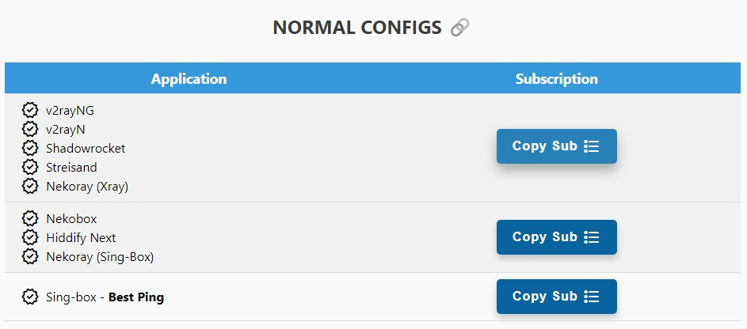
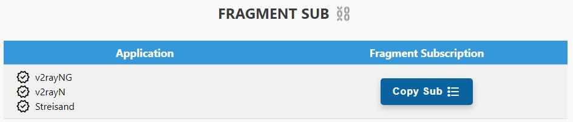
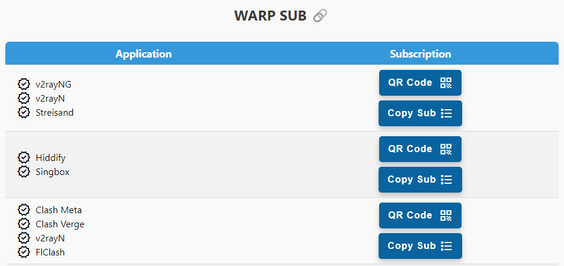
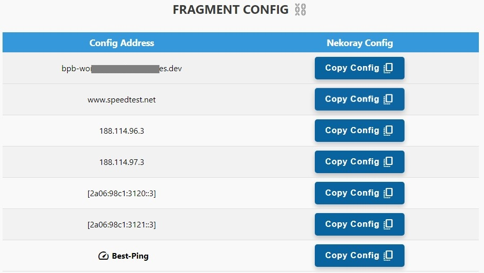
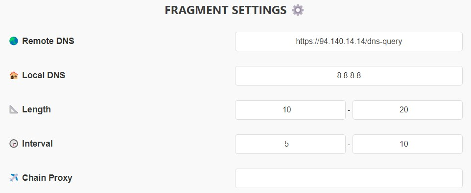
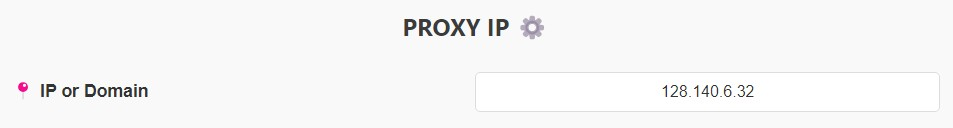
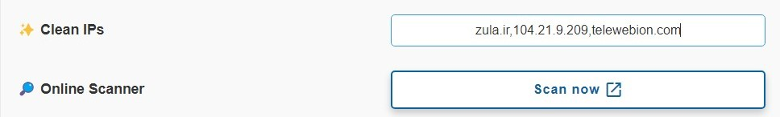

# نحوه استفاده
فرض کنید اسم worker یا pages شما هست `worker-polished-leaf-d022`:

شما میتونید Panel رو با اضافه کردن `panel/` انتهاش مثل زیر ببینید:

>`https://worker-polished-leaf-d022.workers.dev/panel`

ازتون میخواد پسورد جدید بذارید و لاگین کنید و تمام.
> [!IMPORTANT]
> پسورد باید حداقل **8 کاراکتر** باشه و حداقل یه **حرف بزرگ** و یه **عدد** هم توش باشه. برای دفعات بعدی از پایین پنل هم میتونید پسورد رو عوض کنید.
حالا بریم بخشای مختلف پنل رو بررسی کنیم:
  
## 1 - کانفیگ‌های نرمال

  

از این بخش شروع کردم چون خیلیا بدون فرگمنت هم میتونن استفاده کنن.

این بخش لینک اشتراک کانفیگ‌های معمولی رو میده (بدون Fragment). بر اساس اپلیکیشن خودتون لینک رو بردارید و اسنفاده کنید. ساب Sing-box مخصوص IOS و Android از نوع **Best Ping** هست. تا حدود 90% تبلیغات ایرانی و خارجی رو بلاک میکنه، سایت‌های ایرانی رو دور میزنه (نیاز به خاموش کردن VPN برای درگاه پرداخت و ... نیست) و همینطور لینک‌های Phishing و Malware و ... رو هم مسدود میکنه.
> [!TIP]
> کانفیگ **Best Ping** چیه؟ این کانفیگ اومده همه‌ی کانفیگای پنل رو ادغام کرده و هر 3 دقیقه چک میکنه کدوم کانفیگ سرعت بهتری داره به اون وصل میشه! اگر ip تمیز وارد کرده باشید اونم داخل Best Ping اضافه میشه. این نوع کانفیگ رو توی ساب فرگمنت و کانفیگ تکیش رو برای Nekoray هم در ادامه داریم.

این لینک 6 تا کانفیگ بهتون میده. (از بخش تنظیمات IP تمیز و Port میتونید تعداد کانفیگها رو زیاد کنید) حالا فرق این 6 تا کانفیگ چیه؟ چطور میشه تعدادشون رو اضافه کرد؟ توضیحات و تنظیمات بیشتر رو [اینجا](3-5--تنظیمات-ip-تمیز) و [اینجا](3-6--تنظیمات-port) توضیح دادیم. 
> [!CAUTION]
>برای استفاده از این کانفیگ ها Mux رو از تنظیمات هر اپلیکیشنی که استفاده میکنید خاموش کنید.

> [!WARNING]
>با استفاده از این Worker مرتب IP دیوایس شما تغییر میکنه، بنابراین برای کارهایی مثل ترید و PayPal و حتی سایتهایی مثل Hetzner که حساس هستن ازش استفاده نکنید، امکان Ban شدن هست. در مورد فیکس کردن IP دو تا راه‌حل دادیم، یکی Proxy IP موقع راه‌اندازی و دومی Proxy Chain که [اینجا](#3-2--تنظیمات-chain-proxy) بیشتر توضیح دادیم.
  
## 2 - سابسکریپشن و کانفیگ‌های Fragment

> [!NOTE]
> **خواص کانفیگای Fragment این پنل**
> 
> 1- حذف تبلیغات ایرانی و خارجی تا 80%
> 
> 2- دور زدن سایتای ایرانی (نیاز به قطع VPN نیست دیگه)
> 
> 3- اتصال حتی در صورت فیلتر شدن دامنه‌ی شخصی یا ورکر
> 
> 4- بهبود کیفیت و سرعت روی همه‌ی اپراتورا مخصوصا اونایی که اختلال دارن روی کلادفلر
> 
> 5- باز شدن تمام سایتا حتی اونایی که روی کلادفلر هستن (ورکرای قدیمی این مشکل رو داشتن)
 

> [!TIP]
> کانفیگ WorkerLess بدون ورکر خیلی از سایت‌ها و اپلیکیشن‌های فیلتر شده رو باز میکنه! مثل یوتیوب، توییتر، Google Play و سایت‌های فیلتر شده‌ی دیگه که اینجا جا نمیشه. حواستون باشه که این کانفیگ چون از ورکر استفاده نمیکنه IP شما رو تغییر نمیده بنابراین برای کارهای امنیتی مناسب نیست. تغییراتی که برای فرگمنت در پنل اعمال میکنید روی این کانفیگ هم اعمال میشه بجز Chain Proxy.

> [!TIP]
> کانفیگ Best Fragment میاد 18 مقدار مختلف فرگمنت رو اعمال میکنه و هر کدوم سرعت بیشتری داشته باشن رو بر اساس اپراتور شما انتخاب مبکنه! این 18 حالت جوری انتخاب شده که هیچ بازه‌ای از قلم نیافته و کانفیگ تمام بازه‌های کوچیک و بزرگ رو هر 1 دقیقه تست کنه و به بهترینش وصل بشه. 

در ادامه نحوه استفاده از این کانفیگ‌ها رو توضیح دادیم. تنظیمات پیشرفته مربوط به فرگمنت هم [اینجا](#3-1--تنظیمات-فرگمنت/) توضیح داده شده.
  
### 2-1- استفاده روی موبایل

  

یه جدول داریم که یه ساب میده و برای اپلیکیشن‌های v2rayNG و v2rayN و Streisand هست.
وارد کردنش داخل اپ هم مثل ساب معمولیه.

این ساب همون تعداد کانفیگ که تو ساب معمولی داشتید رو با فرگمنت بهتون میده (با تنظیمات
فرگمنتی که توی پنل اعمال کردید) به اضافه‌ی کانفیگ **Best Ping**. شما هر تنظیماتی که داخل پنل انجام بدید وقتی ساب رو آپدیت کنید روی همه‌ی کانفیگا اعمال میشه.
> [!CAUTION]
> برای اینکه به مشکل نخورید ورژن v2rayNG باید حداقل 1.8.19 و ورژن v2rayN باید حداقل 6.42 باشه.

> [!NOTE]
>اپلیکیشن‌های Nekobox و Hiddify Next این کانفیگا رو نداره چون Nekobox کلا فرگمنت رو پشتیبانی نمیکنه. برای برنامه‌ی Hiddify Next اول از ساب Normal کانفیگا رو بگیرید، بعد از تنظیمات خود اپلیکیشن باید Fragment رو اینجوری فعال کنید:

  

 

### 2-2- سابسکریپشن Warp

  

این بخش یه کانفیگ Warp میده که IP کلادفلر ایران هست و یه کانفیگ Warp on Warp (به اختضار WoW) که IP خارجه و یه کافیگ Warp Best Ping که میاد به سریعترین کانفیگ Warp وصل میشه. بصورت پبشفرض یه کانفیگ Warp و WoW بیشتر نیست ولی اگر قسمت Warp Endpoints و WoW Endpoints رو ویرایش کنید به تعداد Endpoint های ورودی کانفیگ Warp اضافه میشه.

> [!CAUTION]
> 1- دقت کنید وارد کردن Endpoint به صورت IP:Port یا Domain:port هست و باید بینشون ویرگول باشه.
> 
> 2- برای وارد کردن IPv6 باید داخل [] قرارش بدید. به مثال زیر دقت کنید:
> 
> 123.45.8.6:1701 , engage.cloudflareclient:2408 , [2a06:98c1:3120::3]:939

کانفیگ WoW روی هسنه Xray عملکرد خوبی نداره متاسفانه. در نظر داشته باشید حتما از اسکنر استفاده کنید برای پیدا کردن Endpoint مناسب روی اپراتور خودتون. اسکریپت اسکنر داخل پنل هست، کپی کنید و داخل Termux روی اندروید اجراش کنید. هر بار که ساب Warp رو آپدیت کنید کانفیگ‌های Warp و WoW تغییر میکنن ولی از همون Endpoint های شما استفاده میکنن. ترجیحا از اپلیکیشن MahsaNG برای اپراتورهایی که وارپ متصل نمیشه استفاده کنهید.
  
### 2-3- استفاده از فرگمنت در DESKTOP - Nekoray

  

این بخش هم همون کانفیگ‌های فرگمنت رو میده برای برنامه‌ی Nekoray روی Windows و Linux.

حالا چجوری تو اپ وارد کنیم؟ اول Copy Config رو میزنید بعد داخل نکوری:
>1. Right Click
>2. New Profile
>3. type > Custom (xray config)
>4. Paste
   
در اینجا هم دقت کنید که **Best Ping** را داریم.
  
## 3 - تنظیمات پیشرفته

### 3-1- تنظیمات فرگمنت

  

این قسمت برای تنظیمات کانفیگای Fragment هست و تاثیری روی کانفیگ ها بخش نرمال نداره.

کانفیگای Fragment چند تا مقدار پیشفرض دارن که تقریبا روی همه اپراتورا جواب میدن. ولی حالا فرض کنید طبق تجربه شما تنظیماتی دارید که روی اپراتور خودتون همیشه بهتر جواب میده و میخواید اعمال کنید. اینا رو میتونید عوض کنید:
1. **سرور DNS** - بطور پیشفرض من Adguard DNS رو گذاشتم برای Remote DNS (برای حذف تبلیغات و spam و ...) و Google DNS رو گذاشتم برای Local DNS. یعنی تو کانفیگ پیشفرض اینه:

>`Remote DNS: https://94.140.14.14/dns-query`
>
>`Local DNS: 8.8.8.8`
2. **پارامترهای Fragment** -  بصورت پیشفرض:
   

>`Length: 100-200`
>
>`Interval: 5-10`

خب حالا میتونید مثلا DNS کلادفلر رو جایگزین کنید (1.1.1.1) و یا بقیه پارامترا رو تنظیم کنید و Apply رو بزنید. اینجوری کانفیگای فرگمنت با تنظیمات شما ارائه میشن.
> [!CAUTION]
> به هیچ عنوان از [https://1.1.1.1/dns-query](https://1.1.1.1/dns-query) برای remote DNS استفاده نکنید چون پینگ رو بالا میبره.

> [!NOTE]
> میتونید یکی از پارامترا رو عوض کنید یا همشو با هم. هر تغییری که بدید ذخیره میشه و دفعه بعد نیازی به تنظیم از اول نیست.

> [!IMPORTANT]
> مقادیر فرگمنت حداکثر دارن، Length بیشتر از 500 نمیتونه باشه، Interval بیشتر از 30.

 

### 3-2- تنظیمات Chain Proxy

  

قبلا گفتیم که میشه یه دونه Proxy IP گذاشت و IP رو برای سایت‌های پشت کلادفلر ثابت کرد، اما کماکان وقتی سایتای معمولی رو باز میکنیم IP ما متعلق به ورکر هست که اینم هر چند وقت یک بار عوض میشه. برای اینکه کلا برای همه‌ی سایت‌ها IP رو فیکس کنیم این قسمت اضافه شده. میتونیم یه کانفیگ VLESS رایگان که حتی فیلتر هم شده باشه (بشرطی که فقط تو ایران فیلتر شده باشه ولی کار کنه) این قسمت بذاریم و IP ما برای همیشه ثابت میشه به IP این کانفیگ.
   
> [!CAUTION]
> 1- این کانفیگ نباید خودش ورکر باشه وگرنه بازم IP نهاییتون تغییر میکنه.
>
> 3- برای دریافت کانفیگ رایگان منبع زیاده، من سایت [racevpn.com](https://racevpn.com) رو توصیه میکنم که البته محدودیت زمانی داره، بر اساس کشور میتونید کانفیگ بگیرید. از کانفیگای [IRCF](https://ircfspace.github.io/tconfig/) و یا بات تلگرامی [ی ب خ](https://t.me/TheTVCbot) هم میتونید استفاده کنید ولی ممکنه بعضی از کانفیگاشون از کار افتاده باشه.
> 
> 2- کانفیگ فقط میتونه VLESS باشه و یکی از انواع زیر:
> 
> `Reality TCP`
> 
> `Reality GRPC`
> 
> `Reality WS`
> 
> `Reality TCP Header`
> 
> `WS TLS`
> 
> `GRPC TLS`
> 
> `TCP TLS`
> 
> `WS`
> 
> `GRPC`
> 
> `TCP`
> 
> `TCP Header`

 

### 3-3- تنظیمات Proxy IP

برای تغییر Proxy IP از ورژن 2.3.5 به بعد میتونید از طریق خود پنل انجام بدید، به این ترتیب که اعمال میکنید و ساب رو آپدیت میکنید و تمام. اما توصیه میکنم از روش قدیمی داشبورد کلادفلر انجام بدید چون:

> [!CAUTION]
> اگر از طریق پنل Proxy IP رو اعمال کنید و اون IP از کار بیافته، باید یه IP جایگزین کنید و ساب رو آپدیت کنید. معنیش اینه که اگر کانفیگ اهدا کرده باشید و Proxy IP رو تغییر بدید دیگه فایده‌ای نداره چون یوزر ساب نداره که کانفیگ رو آپدیت کنه. بنابراین توصیه میشه از این روش فقط برای مصرف شخصی استفاده کنید. اما خوبی روش قدیمی اینه که نیازی به آپدیت کردن کانفیگ‌ها نداره.

برای مثال میتونید از لینک‌ زیر Proxy IP انتخاب کنید، یه تعدادی IP نشون میده که میتونید کشورشون رو هم چک کنید و یه دونه انتخاب کنید:

>[Proxy IP](https://www.nslookup.io/domains/bpb.yousef.isegaro.com/dns-records/)

 

> [!CAUTION]
> حتما بعد از اعمال ساب رو آپدیت کنید.

 

### 3-4- تنظیمات Routing

این قسمت برای اینه که کانفیگای فرگمنت بتونن دو تا کار رو انجام بدن:
1. تبلیغات ایرانی و خارجی تا حدود 80 درصد مسدود کنن.
3. به سایت‌های ایرانی مستقیم بدون VPN وصل بشن (برای بازدید از بعضی سایت‌ها مخصوصا درگاه پرداخت نیازی به قطع کردن نباشه)
4. مسدودسازی سایت‌های پورن
5. اتصال مستقیم LAN. مثلا دسترسی به 127.0.0.1 یا 192.168.1.1 مستقیم میشه.

در حالت عادی این قسمت غیر فعال شده، چون باید اول مطمئن بشید Geo asset برنامه‌تون آپدیته.
> [!CAUTION]
> اگر فعال کردید و VPN متصل نشد تنها دلیلش آپدیت نبودن Geo asset هست. از منوی برنامه‌ی v2rayNG وارد قسمت Geo asset files بشید و اون علامت ابر یا دانلود رو بزنید تا آپدیت بشن، اگر آپدیت ناموفق باشه وصل نمیشید. اگر هر کاری کردید آپدیت نشد دو تا فایل از دو تا لینک زیر دانلود کنید و بجای آپدیت زدن، دکمه اضافه کردن رو بزنید و این دوتا فایل رو وارد کنید:
> 
>[geoip.dat](https://github.com/Loyalsoldier/v2ray-rules-dat/releases/latest/download/geoip.dat)
> 
>[geosite.dat](https://github.com/Loyalsoldier/v2ray-rules-dat/releases/latest/download/geosite.dat) 

 

### 3-5- تنظیمات IP تمیز

لینک های اشتراک نرمال (بدون فرگمنت) 6 تا کانفیگ بهتون میده. اینجا میتونید تعداد کانفیگها رو زیاد کنید.

حالا فرق این 6 تا کانفیگ چیه؟

1. **مسیر کانفیگ Websocket Path:** هر کانفیگ یه مسیر متفاوت داره.
2. **آدرس کانفیگ:** از این 6 تا کانفیگ آدرس یکیشون www.speedtest.net هست که روی اکثر اپراتورا تمیزه، دومیش دامنه‌ی خود ورکرتونه، و 3 تا 6 هم IP های دامنه‌ی خودتون که اینام معمولا تمیزن. دوتا IPv4 و دوتا IPv6.
> [!TIP]
> روی اپراتورهایی که از IPv6 پشتیبانی میکنن (مثل رایتل، ایرانسل و آسیاتک) اول IPv6 رو روی سیمکارت فعال کنید، بعد داخل تنظیمات V2RayNG گزینه‌ی Prefer IPv6 رو فعال کنید و از بین این 6 تا کانفیگ هم از اون دو تا آخری یا اونی که آدرسش دامنه‌ خودتون هست استفاده کنید. به طور کلی همیشه یه بار Real delay all configuration بزنید و با هر کدوم بهتر بود وصل بشید.

اون 6 تا کانفیگ پیشفرضی که پنل میده همشون IP تمیز هستن، در ضمن اگر از کانفیگای Fragment استفاده کنید دیگه خیلی IP تمیز اهمیتی نداره، اما بعضی اپراتورا مثل مخابرات روی کانفیگای معمولی هنوز IP تمیز میخوان.

خب حالا اگر خواستید علاوه بر اون 6 تا کانفیگ دیگه ای اضافه کنید که با IP تمیز خودتون باشه، مطابق عکس IP یا دامین‌های تمیز خودتون رو با ویرگول وارد کنید و Apply بزنید، اسکنر آنلاین بچه‌های [IRCF](https://ircf.space) رو هم اضافه کردم:

  

الان اگر توی اپلیکیشن Update subscription بزنید میبینید که کانفیگای جدید اضافه شدن.

در ضمن این کانفیگای جدید همزمان به قسمت فرگمنت هم اضافه میشن.

 

### 3-6- تنظیمات Port

از این بخش میتونید پورت‌های مورد نیازتون رو انتخاب کنید. یه نعدادیشون بهتون کانفیگ TLS میدن که امن‌تره ولی وقتایی که روی TLS و Fragment اختلال ایجاد میشه این کانفیگا وصل میشن.
> [!CAUTION]
> دقت کنید برای استفاده از کانفیگ‌های non TLS باید از روش Workers دپلوی کرده باشید. در غیر این صورت Port های http در پنل نمایش داده نمیشن چون با روش Pages کار نمیکنن.

> [!TIP]
> کانفیگ‌های non TLS فقط به ساب نرمال اضافه میشن.

