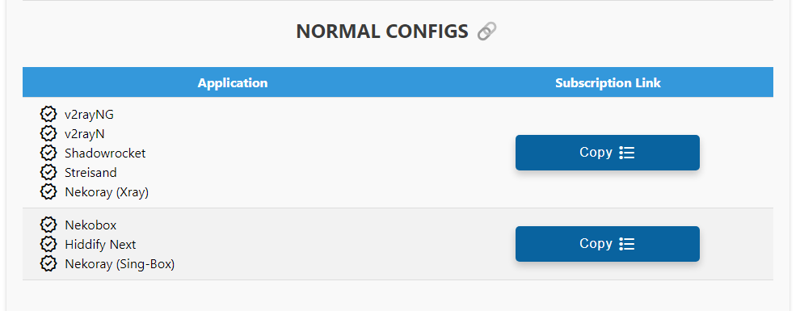
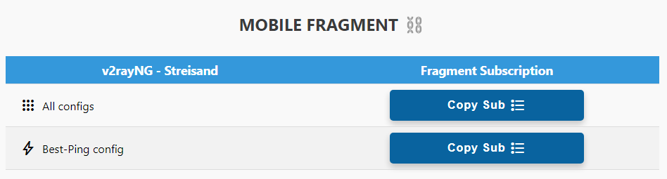
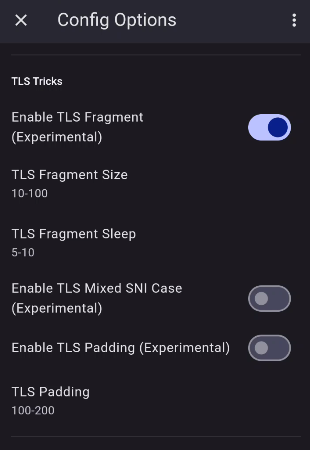
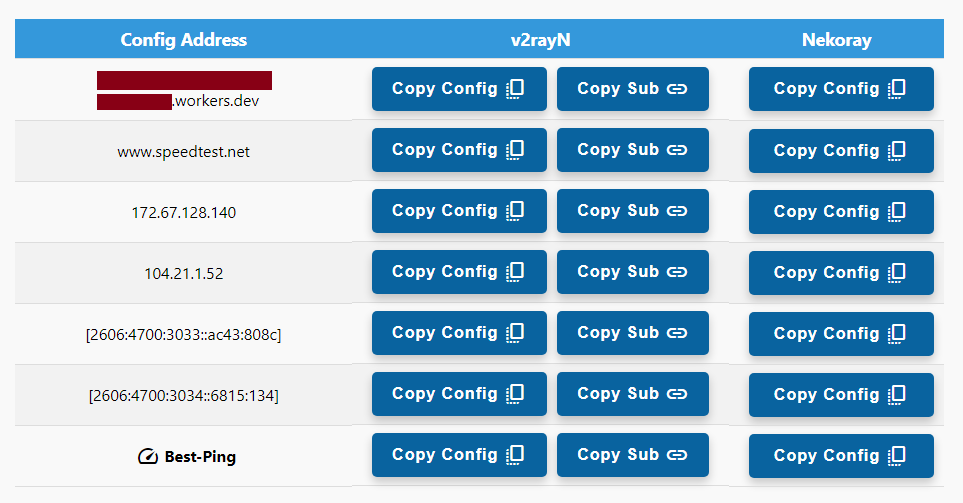
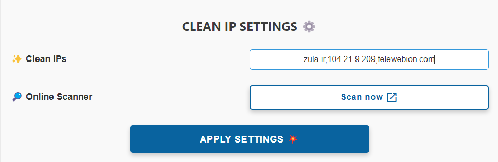
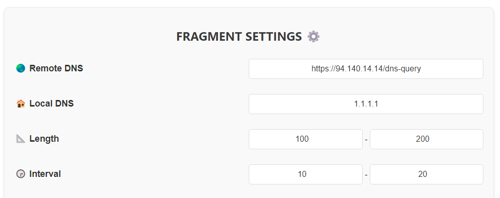

# نحوه استفاده
فرض کنید اسم worker یا pages شما هست worker-polished-leaf-d022:

شما میتونید Panel رو از لینک زیر ببینید:

`https://worker-polished-leaf-d022.workers.dev/panel`

اول میره به صفحه‌ی لاگین، پسورد پیشفرض یعنی admin رو وارد کنید وتمام...

**مهم:** از پایین پنل **reset password** رو بزنید و عوضش کنید، باید حداقل **8 کاراکتر** باشه و حداقل یه **حرف بزرگ** و یه **عدد** هم توش باشه.

حالا بریم بخشای مختلف پنل رو بررسی کنیم:

### 1- کانفیگ های نرمال (بدون فرگمنت)

از این بخش شروع کردم چون خیلیا بدون فرگمنت هم میتونن استفاده کنن.

این بخش لینک اشتراک کانفیگ‌های معمولی Worker رو میده (بدون Fragment). بر اساس کلاینت خودتون لینک رو بردارید و اسنفاده کنید.

این لینک 6 تا کانفیگ بهتون میده. (از بخش تنظیمات IP تمیز میتونید تعداد کانفیگها رو زیاد کنید) حالا فرق این 6 تا کانفیگ چیه؟  چطور میشه تعدادشون رو اضافه کرد؟ توضیحات و تنظیمات بیشتر رو [اینجا](#تنظیمات-ip-تمیز) توضیح دادیم. 

**نکته مهم:** برای استفاده از این کانفیگ ها Mux رو از تنظیمات هر اپلیکیشنی که استفاده میکنید خاموش کنید.

**اخطار:** با استفاده از این Worker مرتب IP دیوایس شما تغییر میکنه، بنابراین برای کارهایی مثل ترید و PayPal و حتی سایتهایی مثل Hetzner که حساس هستن ازش استفاده نکنید، امکان Ban شدن هست. در مورد فیکس کردن IP [اینجا](#آموزش-تکمیلی---فیکس-کردن-ip) بیشتر توضیح دادیم.

### 2 - کانفیگ های فرگمنت (json)

اول خواص کانفیگای Fragment این پنل رو بگم:

   1- حذف تبلیغات ایرانی و خارجی تا 80%

   2- دور زدن سایتای ایرانی (نیاز به قطع VPN نیست دیگه).

   3- اتصال حتی در صورت فیلتر شدن دامنه‌ی شخصی یا ورکر.

   4- بهبود کیفیت و سرعت روی همه‌ی اپراتورا مخصوصا اونایی که اختلال دارن روی کلادفلر.

   5- باز شدن تمام سایتا حتی اونایی که روی کلادفلر هستن (ورکرای قدیمی این مشکل رو داشتن).

در ادامه نحوه استفاده از این کانفیگ ها رو توضیح دادیم . تنظیمات پیشرفته مربوط به فرگمنت هم [اینجا](#تنظیمات-فرگمنت) توضیح داده شده.

**استفاده روی موبایل**

قبل از هر چیزی بگم برای استفاده از این کانفیگ‌ها اول باید برنامه‌تون آپدیت باشه و همینطور باید Geo asset files برنامه V2rayNG آپدیت باشه. وارد این قسمت بشید و اون علامت ابر یا دانلود رو بزنید تا آپدیت بشن، اگر آپدیت ناموفق باشه وصل نمیشید. اگر هر کاری کردید آپدیت نشد دو تا فایل از دو تا لینک زیر دانلود کنید و بجای آپدیت زدن، دکمه اضافه کردن رو بزنید و این دوتا فایل رو وارد کنید:

[https://github.com/Loyalsoldier/v2ray-rules-dat/releases/latest/download/geoip.dat](https://github.com/Loyalsoldier/v2ray-rules-dat/releases/latest/download/geoip.dat)

[https://github.com/Loyalsoldier/v2ray-rules-dat/releases/latest/download/geosite.dat](https://github.com/Loyalsoldier/v2ray-rules-dat/releases/latest/download/geosite.dat)

خب حالا یه جدول داریم که دو تا ساب میده و برای اپلیکیشن‌های v2rayNG و Streisand هست.
وارد کردنش داخل اپ هم مثل ساب معمولیه.

**1- لینک اشتراک All configs:**
این ساب همون تعداد کانفیگ که تو ساب معمولی داشتید رو با فرگمنت بهتون میده (با تنظیمات
فرگمنتی که توی پنل اعمال کردید).

**2 - لینک اشتراک Best-Ping config:**
ما توی این پنل یه کانفیگ طلایی داریم به اسم Best Ping. این کانفیگ اومده 6 تا کانفیگ
بالا رو ترکیب کرده و هر 5 دقیقه چک میکنه کدوم کانفیگ سرعت بهتری داره به اون وصل میشه! اگر ip تمیز وارد کرده
باشید کانفیگ اونم داخل Best Ping اضافه میشه. خلاصه برای این کانفیگ ساب جدا گذاشتم، اینم مثل ساب قبلی اگر تنظیمات
فرگمنت رو تغییر بدید و ساب رو آپدیت کنید اعمال میشه.

**نکته:** اپلیکیشن‌های Nekobox و Hiddify Next این کانفیگا رو نداره چون
Nekobox کلا فرگمنت رو پشتیبانی نمیکنه. برای برنامه‌ی Hiddify Next اول کانفیگای Normal رو از لینک سابسکریپشن لود
کنید، بعد از تنظیمات خودشون باید Fragment رو اینجوری فعال کنید:

**استفاده در DESKTOP**

این بخش هم کانفیگ و ساب فرگمنت میده برای برنامه‌های ویندوز و لینوکس.

ستون دوم برای v2rayN و ستون سوم برای Nekoray. حالا چجوری تو اپ وارد کنیم؟ اول Copy Config رو میزنید بعد:

**V2rayN:** Ctrl + V (فقط Paste کنید)
**Nekoray:** Right Click -&gt; New Profile -&gt; type = Custom (xray config) -&gt; Paste

اگر به ستون دوم نگاه کنید، برنامه‌ی v2rayN یک دکمه دیگر هم دارد که به نام Copy Sub است. مانند ساب معمولی، همین لینک را داخل v2rayN پیست کنید، یک Subscription ساخته و آن را انتخاب کنید:

**V2rayN:** Subscription group -&gt; Update current subscription...

در اینجا هم دقت کنید که Best Ping را داریم.

### تنظیمات پیشرفته

#### تنظیمات IP تمیز

لینک های اشتراک نرمال (بدون فرگمنت)  6 تا کانفیگ بهتون میده. اینجا میتونید تعداد کانفیگها رو زیاد کنید.

حالا فرق این 6 تا کانفیگ چیه؟

   **1 - مسیر کانفیگ Websocket Path:** هر کانفیگ یه مسیر متفاوت داره
	 
   **2 - آدرس کانفیگ:** از این 6 تا کانفیگ آدرس یکیشون www.speedtest.net هست که روی اکثر اپراتورا اوکیه، دومیش دامنه‌ی خود ورکرتونه، و 3 تا 6 هم IP های دامنه‌ی خودتون. دوتا IPv4 و دوتا IPv6.

**پیشنهاد:** روی اپراتورهایی که از IPv6 پشتیبانی میکنن (مثل رایتل، ایرانسل و آسیاتک) اول IPv6 رو روی سیمکارت فعال کنید، بعد داخل تنظیمات V2RayNG گزینه‌ی Prefer IPv6 رو فعال کنید و از بین این 6 تا کانفیگ هم از اون دو تا آخری یا اونی که آدرسش دامنه‌ خودتون هست استفاده کنید.

به طور کلی همیشه یه بار Real delay all configuration بزنید و با هر کدوم بهتر بود وصل بشید.

اون 6 تا کانفیگ پیشفرضی که پنل میده همشون IP تمیز هستن، در ضمن اگر از کانفیگای Fragment استفاده کنید دیگه خیلی IP تمیز اهمیتی نداره، اما بعضی اپراتورا مثل مخابرات روی کانفیگای معمولی هنوز IP تمیز میخوان.

خب حالا اگر خواستید علاوه بر اون 6 تا کانفیگ دیگه ای اضافه کنید که با IP تمیز خودتون باشه، مطابق عکس IP یا دامین‌های تمیز خودتون رو با ویرگول وارد کنید و Apply بزنید:

الان اگر توی اپلیکیشن Update subscription بزنید میبینید که کانفیگای جدید اضافه شدن.

در ضمن این کانفیگای جدید  همزمان به قسمت فرگمنت هم اضافه میشن.

####  تنظیمات فرگمنت

این قسمت برای تنظیمات کانفیگای Fragment هست و تاثیری روی کانفیگ ها بخش نرمال نداره.

کانفیگای Fragment چند تا مقدار پیشفرض دارن که تقریبا روی همه اپراتورا جواب میدن. ولی حالا فرض کنید طبق تجربه شما تنظیماتی دارید که روی اپراتور خودتون همیشه بهتر جواب میده و میخواید اعمال کنید. اینا رو میتونید عوض کنید:

   **1 - سرور DNS** - بطور پیشفرض من Adguard DNS رو گذاشتم برای Remote DNS (برای حذف تبلیغات و spam و ...) و Cloudflare DNS رو گذاشتم برای Local DNS. ینی تو کانفیگ پیشفرض اینه:

`Remote DNS: https://94.140.14.14/dns-query`

`Local DNS: 1.1.1.1`

   **2 - پارامترهای Fragment** -  بصورت پیشفرض:

`Length: 100-200`

`Interval: 10-20`

خب حالا میتونید مثلا DNS گوگل رو بذارید (8.8.8.8) و یا بقیه پارامترا رو تنظیم کنید و Apply رو بزنید. اینجوری کانفیگای فرگمنت با تنظیمات شما ارائه میشن.

**نکته‌ی مهم:** به هیچ عنوان از [https://1.1.1.1/dns-query](https://1.1.1.1/dns-query) برای remote DNS استفاده نکنید چون پینگ رو بالا میبره.

**نکته:** میتونید یکیشو عوض کنید یا همشو با هم. هر تغییری که بدید ذخیره میشه و دفعه بعد نیازی به تنظیم از اول نیست.

**نکته:** مقادیر فرگمنت حداکثر دارن، Length بیشتر از 500 نمیتونه باشه، Interval بیشتر از 30. وارد کردن اعداد اشتباه باعث میشه مقادیر پیشفرض اعمال بشه.

نحوه‌ی استفاده از این کانفیگا رو در 2 بخش بعدی بخونید.

