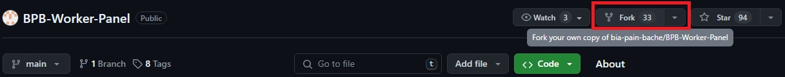
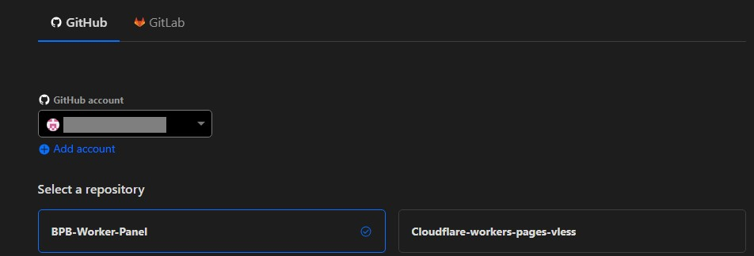
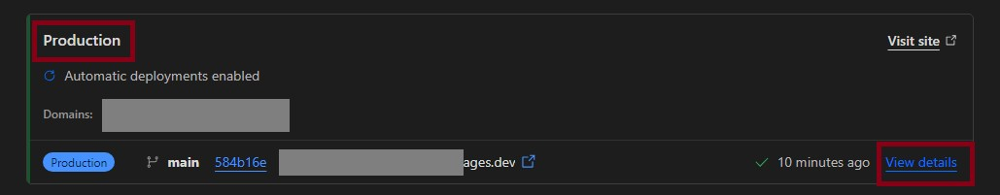
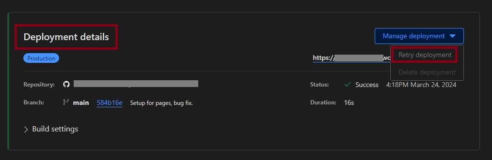
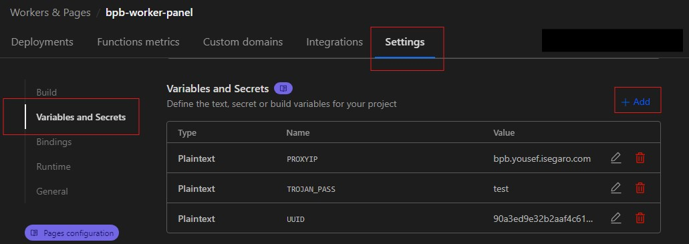

<h1 align="center">نصب از طریق Cloudflare Pages</h1>

## مقدمه
احتمالاً میدونید که دو روش استفاده Worker و Pages برای ساخت پروکسی روی کلادفلر مورد استفاده قرار میگیره، نکته جالب توجه اینه که روش Worker که مرسوم‌تره یه محدودیت داره که روزانه اجازه ارسال بیشتر از صدهزار Request  به شما نمیده. البته این محدودیت برای مصرف ۲-۳ نفر کافیه . برای دور زدن این محدودیت در روش worker  یه دامنه به ورکر وصل میکردیم  و اینجوری نامحدود میشد (که ظاهرا باگ کلادفلر هست). اما Pages این محدودیت رو نداره. البته چون ما در این روش از امکانی به اسم Pages functions استفاده میکنیم  کماکان مشابه Worker شما ایمیلی دریافت خواهید کرد که پر شدن ظرفیت مصرف 100k رو به شما اطلاع میده، در این روش حتی اگر از دامنه شخصی هم استفاده کنید باز این ایمیل رو دریافت می کنید. **ولی در نهایت تجربه نشون داده که سرویس شما قطع نخواهد شد.**

مزیت  مهم دیگه‌ش سهولت در یروزرسانی هست. وقتی کد پروژه به روز بشه شما هم به راحتی و بدون نیاز به طی مجدد مراحل میتونید پنلتون رو به روزرسانی کنید. توضیحات بیشتر در بخش [بروزرسانی](#بروز-رسانی) اومده.

ضمنا مراحل استفاده از Pages بسیار ساده‌تر است و به راحتی روی گوشی موبایلتون میتونید این کارها رو انجام بدید.  

## قدم اول - Github
در سایت [Github](https://github.com/signup) یه اکانت میسازید ( برای ثبت نام فقط یک ایمیل لازم دارید). با مشخصات کاربریتون در گیتهاب لاگین میکنید.

حالا به آدرس گیتهاب [BPB-Worker-Panel](https://github.com/bia-pain-bache/BPB-Worker-Panel) میرید و از اون بالا دکمه‌ی Fork رو میزنید.
  

  

تو صفحه‌ی بعدی به هیچی دست نزنید و Create Fork رو بزنید. خب کار ما با گیتهاب تموم شد.
  

## قدم دوم - Cloudflare Pages
اگر اکانت کلود فلر ندارید از [اینجا](https://dash.cloudflare.com/sign-up) یک اکانت بسازید (اینجا هم فقط یک ایمیل برای ثبت نام لازم دارید).

حالا در اکانت کلادفلرتون از منوی سمت چپ وارد قسمت `Workers and Pages` بشید (همونجا که ورکر میساختیم) و `Create Application` رو بزنید. با این تفاوت این دفعه `Pages` رو انتخاب میکنیم:

  

اینجا `Connect to Git` رو میزنید و میرید مرحله بعد:

  

اینجا روی `BPB-Worker-Panel` کلیک کنید تا فعال بشه و `Begin Setup` رو بزنید. مرحله‌ی بعد یه `Project Name` داره که میشه دامین پنل شما، اونو حتما عوض کنید یه اسم دلخواه بذارید. حالا اینجا یه فرقی با Workers داره، یعنی اگر بخواید UUID یا Proxy IP رو عوض کنید دیکه نمیتونید برید توی کد تغییر بدید، اگر خواستید از پیشفرض پنل استفاده کنید که هیچ، اگرنه همین الان برید بخش [تنظیمات پیشرفته](#تنظیمات-پیشرفته-اختیاری) رو بخونید و بعد ادامه بدید.

دیگه الان میتونید `Save and Deploy` رو بزنید.
یه چند ثانیه زمان میخواد تا پروژه نصب بشه، صبر کنید تا دکمه‌ی `Continue to Project` ظاهر بشه و بزنید و برید تو صفحه‌ی پروژه.
  
## قدم سوم - ساخت Cloudflare KV
از منوی سمت چپ میریم به قسمت KV:

  

روی `Create a namespace` کلیک میکنیم و یه اسم دلخواه بهش میدیم و Add میکنیم.

برگردید به قسمت `Workers and Pages` و وارد اون پروژه‌ی Pages بشید که ساختید، با توجه به عکس زیر برید قسمت `Settings`:

  

اینجا مثل ورکر تو صفحه قسمت `Bindings` رو پیدا کنید، `Add` بزنید و `KV Namespace` رو انتخاب کنید، `Variable name` باید حتما `bpb` باشه (همینجوری که نوشتم) و `KV namespace` اون KV رو انتخاب میکنید که مرحله دو ساختید و `save` میکنید.

  

خب کارمون با KV تموم شد، حالا فقط باید دوباره Deploy کنیم که تغییرات KV اعمال بشه.

از نوار بالا به قسمت `Deployment` برگردید و از بخش `Production` برید به `view details`:

  

حالا تو قسمت `Deployment detail` دکمه‌ی `Manage Deployment` رو بزنید و `Retry deployment`:

  

چند ثانیه صبر میکنید تا مراحلش تموم شه و کار ما تموم شد!

یه Back بزنید و از قسمت `Production` روی `visit site` بزنید، بعد یه `panel/` تهش اضافه کنید و وارد پنل بشید.
آموزشهای تنظیمات و نکات هم که تو [آموزش اصلی](configuration_fa.md)  هست.
نصب به پایان رسیده و توضیحاتی که در ادامه اومده شاید برای عموم لازم نباشه!
  
##  تنظیمات پیشرفته (اختیاری)
شاید تا الان متوجه شده باشید که در مورد تغییر UUID و Proxy IP و پسوردای Trojan چیزی نگفتیم، چون شما میتونید بدون انجام این مرحله از تنظیمات پیشفرض پنل استفاده کنید. ولی توصیه میکنم حداقل UUID و پسوردهای Trojan رو عوض کنید.
  

### 1- تغییر UUID:

همونطور که میدونید UUID  مثل اسم رمزی میمونه که داخل لینک‌های اشتراک و کانفیگ ها قرار میگیره و شما در صورت نیاز میتونید تغییر بدید. در صورت تغییر این پارامتر اتصال کاربرهای شما قطع میشه  و لازم هست لینک اشتراک و یا کانفیگ ها رو مجددا در اختیارشون قرار بدید. در صورتی که این UUID رو در این مرحله تعریف نکنید هم کد از یک UUID پیشفرض استفاده خواهد کرد.
  

### 2- ثابت کردن Proxy IP:

ما یه مشکلی داریم که این کد به صورت پیشفرض از تعداد زیادی IP Proxy استفاده میکنه که برای هر بار اتصال به سایتای پشت کلادفلر ( شامل بخش وسیعی از وب میشه) به صورت رندوم IP جدیدی انتخاب میکنه و در نتیجه به صورت متناوب IP شما تغییر پیدا میکنه. این تغییر IP شاید برای برخی مشکل ساز باشه (مخصوصا تریدرها). برای تغییر Proxy IP از ورژن 2.3.5 به بعد میتونید از طریق خود پنل انجام بدید، به این ترتیب که اعمال میکنید و ساب رو آپدیت میکنید و تمام. اما توصیه میکنم از روشی که در ادامه توضیح دادم استفاده کنید چون:

> [!CAUTION]
> اگر از طریق پنل Proxy IP رو اعمال کنید و اون IP از کار بیافته، باید یه IP جایگزین کنید و ساب رو آپدیت کنید. معنیش اینه که اگر کانفیگ اهدا کرده باشید و Proxy IP رو تغییر بدید دیگه فایده‌ای نداره چون یوزر ساب نداره که کانفیگ رو آپدیت کنه. بنابراین توصیه میشه از این روش فقط برای مصرف شخصی استفاده کنید. اما خوبی روش دوم که در ادامه میگم اینه که از طریق داشبورد کلادفلر انجام میشه و نیازی به آپدیت کردن کانفیگ‌ها نداره.
  

### 3- تغییر پسوردهای Trojan:

پروتکل Trojan با پسوردهای پیشفرض خودش کار میکنه ولی با توجه به اینکه تعداد زیادی از این پنل استفاده میکنن، توصیه میکنم حتما این دو تا پسورد عوض بشن.

 

برای تغییر UUID و Proxy IP و پسوردهای Trojan توی همین صفحه (قدم سوم، جایی که BPB-Worker-Panel رو انتخاب میکنید) میاید پایین و قسمت `Environment variables` رو باز میکنید:

  

اینجا باید مقادیر رو مشخص کنید. یه بار `Add variable` بزنید و خونه اول رو بنویسید `UUID` با حروف بزرگ، بعد از [اینجا](https://www.uuidgenerator.net/) یه UUID بگیرید و بذارید خونه دوم.

حالا یه بار دیگه `Add variable` بزنید خونه اول `PROXYIP` با حروف بزرگ، IP رو هم میتونید از لینک‌ زیر بگیرید، اینا رو باز کنید یه تعدادی IP نشون میده که میتونید کشورشون رو هم چک کنید و یه دونه انتخاب کنید:

>[Proxy IP](https://www.nslookup.io/domains/bpb.yousef.isegaro.com/dns-records/)

  

یه بار دیگه `Add variable` بزنید خونه اول `TROJAN_PASS` با حروف بزرگ، یه پسورد دلخواه بذارید.

دوباره `Add variable` بزنید خونه اول `HASH_PASS` با حروف بزرگ و:
- وارد این سایت بشید و `TROJAN_PASS` رو بذارید input خودش قسمت output سریع `HASH_PASS` رو بهتون میده.
> https://emn178.github.io/online-tools/sha224.html

- یا اگر از این استفاده میکنید، `TROJAN_PASS` رو میذارید سمت چپ و convert رو میزنید.

> https://www.atatus.com/tools/sha224-to-hash

> [!TIP]
> اگر موقع دپلوی کردن این تنظیمات رو انجام ندادید بعدا هم میتونید از قسمت Settings این مقادیر رو اضافه کنید. از قسمت `Workers and Pages` وارد اون پروژه‌ی Pages بشید که ساختید، با توجه به عکس زیر برید قسمت `Settings` و پایین‌تر `Variables and Secrets`:

  

هر بار `Add` میزنید و یه کدوم رو وارد میکنید و `Save` میکنید:

  

و در نهایت از نوار بالا به قسمت `Deployment` برگردید و از بخش `Production` برید به `view details` و تو قسمت `Deployment detail` دکمه‌ی `Manage Deployment` رو بزنید و `Retry deployment`.
 
 

## بروز رسانی:
یکی از مزیت‌های Pages نسبت به Worker اینه که وقتی آپدیتی برای کد منتشر میشه دیگه نیازی نیست برید ورژن جدید worker.js رو دانلود کنید و روز از نو روزی از نو! اصلا برای آپدیت دیگه کاری به کلادفلر ندارید. کافیه به گیتهاب خودتون برید وارد ریپازیتوری `BPB-Worker-Panel` بشید و از اینجا `Sync fork` رو بزنید:

  

بعد `Update branch` رو میزنید و تمام. خوبیش اینه که با این کار Cloudflare Pages خودش متوجه میشه و در حدود ۱ دقیقه بعد خودبخود آپدیت میکنه براتون.
