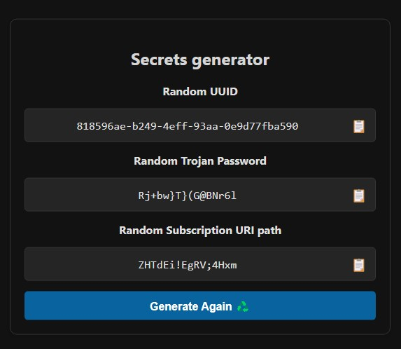
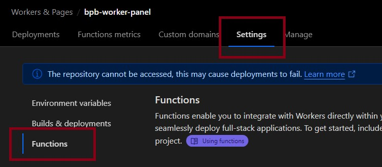
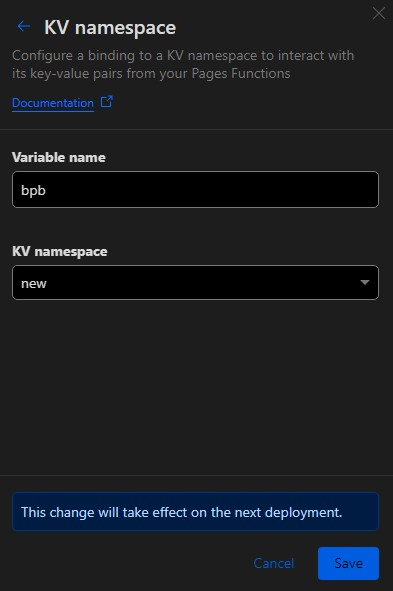
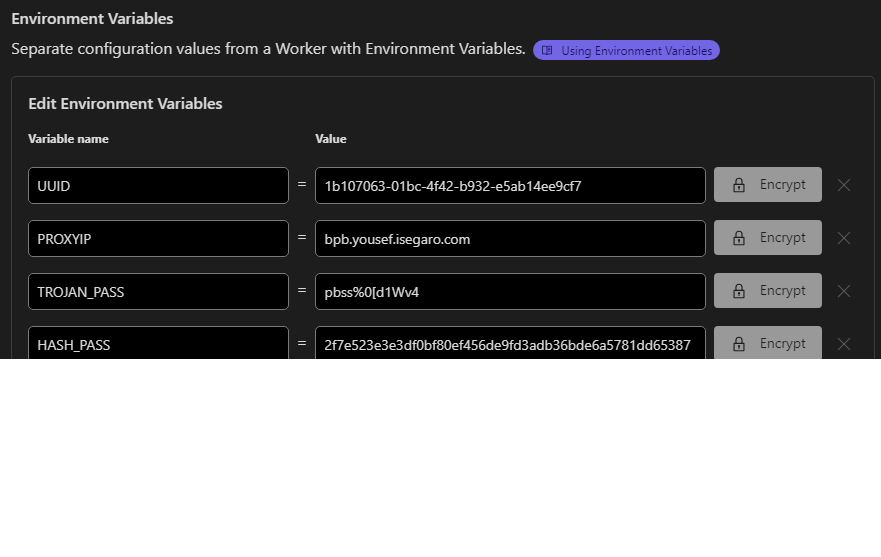

<h1 align="center">نصب از طریق Cloudflare Pages با آپلود</h1>

## مقدمه
احتمالاً میدونید که دو روش استفاده Worker و Pages برای ساخت پروکسی روی کلادفلر مورد استفاده قرار میگیره، نکته جالب توجه اینه که روش Worker که مرسوم‌تره یه محدودیت داره که روزانه اجازه ارسال بیشتر از صدهزار Request  به شما نمیده. البته این محدودیت برای مصرف ۲-۳ نفر کافیه . برای دور زدن این محدودیت در روش worker  یه دامنه به ورکر وصل میکردیم و اینجوری نامحدود میشد (که ظاهرا باگ کلادفلر هست). اما Pages این محدودیت رو نداره (اخیرا بعضی موارد گزارش شده که این روش هم محدودیت خواهد داشت، خودتون تست کنید). البته چون ما در این روش از امکانی به اسم Pages functions استفاده میکنیم  کماکان مشابه Worker شما ایمیلی دریافت خواهید کرد که پر شدن ظرفیت مصرف 100k رو به شما اطلاع میده، در این روش حتی اگر از دامنه شخصی هم استفاده کنید باز این ایمیل رو دریافت می کنید. **ولی در نهایت تجربه نشون داده که سرویس شما قطع نخواهد شد.**

## قدم اول - Cloudflare Pages
اگر اکانت کلود فلر ندارید از [اینجا](https://dash.cloudflare.com/sign-up) یک اکانت بسازید (اینجا هم فقط یک ایمیل برای ثبت نام لازم دارید، بخاطر حساسیت‌های کلادفلر توصیه میکنم از ایمیل‌های معتبر مثل Gmail استفاده کنید).

از [اینجا](https://github.com/bia-pain-bache/BPB-Worker-Panel/releases/latest/download/worker.zip) فایل زیپ ورکر رو دانلود کنید.

حالا در اکانت کلادفلرتون از منوی سمت چپ وارد قسمت `Workers and Pages` بشید و `Create Application` رو بزنید و `Pages` رو انتخاب کنید:

  

اینجا `Upload assets` رو میزنید و میرید مرحله بعد.
یه `Project Name` داره که میشه دامنه‌ی پنل شما، یه اسم دلخواه بذارید که کلمه‌ی bpb هم داخلش نباشه وگرنه ممکنه اکانتتون توسط کلادفلر شناسایی بشه. `Create Project` رو بزنید. این مرحله باید اون فایل Zip که دانلود کردید رو آپلود کنید، برای این کار `Select from computer` رو بزنید و بعد Upload zip رو انتخاب کنید و فایل رو آپلود کنید و در نهایت `Deploy site` و بعد هم `Continue to project`.

خب پروژه‌ی شما ساخته شد ولی هنوز قابل استفاده نیست. از همین صفحه‌ی `Deployment` قسمت `Production` روی `visit` کلیک کنید، میبینید ارور داده که اول باید UUID و Trojan Password رو تنظیم کنید، یه لینک داره، داخل مرورگر بازش کنید  بذارید باشه برای مرحله بعد نیاز میشه.

  

## قدم سوم - ساخت Cloudflare KV و تنظیم UUID و Trojan Password
از منوی سمت چپ میریم به قسمت KV:

  

روی `Create a namespace` کلیک میکنیم و یه اسم دلخواه بهش میدیم و Add میکنیم.

برگردید به قسمت `Workers and Pages` و وارد اون پروژه‌ی Pages بشید که ساختید، با توجه به عکس زیر برید قسمت `Settings`:

  

اینجا مثل ورکر تو صفحه قسمت `Bindings` رو پیدا کنید، `Add` بزنید و `KV Namespace` رو انتخاب کنید، `Variable name` باید حتما `bpb` باشه (همینجوری که نوشتم) و `KV namespace` اون KV رو انتخاب میکنید که مرحله دو ساختید و `save` میکنید.

  

خب کارمون با KV تموم شد.

تو همین قسمت `Settings` بخش `Variables and Secrets` رو میبینید، `Add variable` بزنید خونه اول `UUID` با حروف بزرگ، UUID رو هم میتونید از همون لینک مرحله قبل بگیرید و کپی کنید قسمت Value و `Save` کنید. یک بار دیگه `Add variable` بزنید خونه اول `TROJAN_PASS` با حروف بزرگ، پسورد Trojan رو هم میتونید از همون لینک مرحله قبل بگیرید و کپی کنید قسمت Value و `Save` کنید.

خب حالا از بالای صفحه `Create deployment` رو بزنید و دوباره مثل قبل همون فایل zip رو آپلود کنید.

الان میتونید برگردید به صفحه‌ی `Deployments` و از قسمت `Production` روی `visit` بزنید، بعد یه `panel/` تهش اضافه کنید و وارد پنل بشید.
آموزشهای تنظیمات و نکات هم که تو [آموزش اصلی](configuration_fa.md)  هست.
نصب به پایان رسیده و توضیحاتی که در ادامه اومده شاید برای عموم لازم نباشه!
  
<h1 align="center">تنظیمات پیشرفته (اختیاری)</h1>

## 1- ثابت کردن Proxy IP:

ما یه مشکلی داریم که این کد به صورت پیشفرض از تعداد زیادی IP Proxy استفاده میکنه که برای هر بار اتصال به سایتای پشت کلادفلر ( شامل بخش وسیعی از وب میشه) به صورت رندوم IP جدیدی انتخاب میکنه و در نتیجه به صورت متناوب IP شما تغییر پیدا میکنه. این تغییر IP شاید برای برخی مشکل ساز باشه (مخصوصا تریدرها). برای تغییر Proxy IP از ورژن 2.3.5 به بعد میتونید از طریق خود پنل انجام بدید، به این ترتیب که اعمال میکنید و ساب رو آپدیت میکنید و تمام. اما توصیه میکنم از روشی که در ادامه توضیح دادم استفاده کنید چون:

> [!CAUTION]
> اگر از طریق پنل Proxy IP رو اعمال کنید و اون IP از کار بیافته، باید یه IP جایگزین کنید و ساب رو آپدیت کنید. معنیش اینه که اگر کانفیگ اهدا کرده باشید و Proxy IP رو تغییر بدید دیگه فایده‌ای نداره چون یوزر ساب نداره که کانفیگ رو آپدیت کنه. بنابراین توصیه میشه از این روش فقط برای مصرف شخصی استفاده کنید. اما خوبی روش دوم که در ادامه میگم اینه که از طریق داشبورد کلادفلر انجام میشه و نیازی به آپدیت کردن کانفیگ‌ها نداره.
  

برای تغییر Proxy IP وقتی وارد پروژه میشد از قسمت `Settings` قسمت `Environment variables` رو باز میکنید:

  

اینجا باید مقادیر رو مشخص کنید. هر بار `Add` میزنید و یه کدوم رو وارد میکنید و `Save` میکنید:

  

 

حالا `Add variable` بزنید خونه اول `PROXYIP` با حروف بزرگ، IP رو هم میتونید از لینک‌ زیر بگیرید، اینا رو باز کنید یه تعدادی IP نشون میده که میتونید کشورشون رو هم چک کنید و یک یا چندتا انتخاب کنید:

>[Proxy IP](https://www.nslookup.io/domains/bpb.yousef.isegaro.com/dns-records/)

  

> [!TIP]
> اگر خواستید چند Proxy IP داشته باشید میتونید با ویرگول وارد کنید، مثل `151.213.181.145`,`5.163.51.41`,`bpb.yousef.isegaro.com`

خب حالا از بالای صفحه `Create deployment` رو بزنید و دوباره مثل اول همون فایل zip رو آپلود کنید، تغییرات اعمال میشه.
  

## 2- اتصال دامنه به Pages:

برای این کار به داشبورد کلادفلر میرید و از قسمت `Workers and Pages`  پنل خودتون رو انتخاب میکنید. به قسمت `Custom domains` میرید و `set up a custom domain` رو میزنید. اینجا ازتون میخواد یه Domain وارد کنید (دقت کنید قبلا باید یه دامنه خریداری کرده باشید و روی همین اکانت فعال کرده باشید که اینجا جای آموزشش نیست). حالا فرض کنید یه دامنه دارید به اسم bpb.com، در قسمت Domain میتونید خود دامنه یا یک زیردامنه دلخواه بزنید. مثلا xyz.bpb.com، بعد هم `Continue` رو میزنید و در صفحه‌ی بعد هم `Activate domain`. کلادفلر خودش میره Pages رو به دامنه‌ی شما متصل میکنه (یه مدت طول میکشه تا این اتفاق بیافته، خود کلادفلر میگه ممکنه تا 48 ساعت طول بکشه). خب بعد از این مدت میتونید از آدرس `https://xyz.bpb.com/panel` وارد پنلتون بشید و ساب‌های جدید رو دریافت کنید.
  

<h1 align="center">بروز‌رسانی پنل</h1>

برای بروزرسانی مثل مرحله‌ی ساخت از [اینجا](https://github.com/bia-pain-bache/BPB-Worker-Panel/releases/latest/download/worker.zip) فایل زیپ جدید رو دانلود کنید. در اکانت کلادفلرتون برید به قسمت `Workers and Pages` و وارد اون پروژه‌ی Pages بشید که ساختید، از بالای صفحه `Create deployment` رو بزنید و دوباره مثل اول همون فایل zip جدید رو آپلود کنید و تمام.