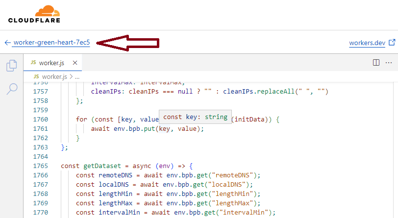
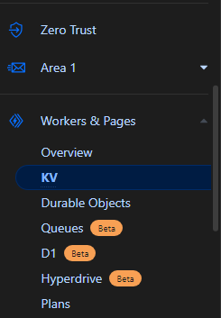
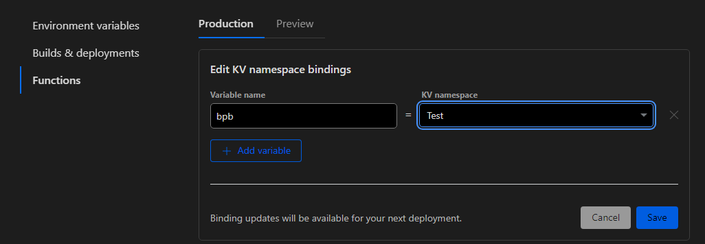
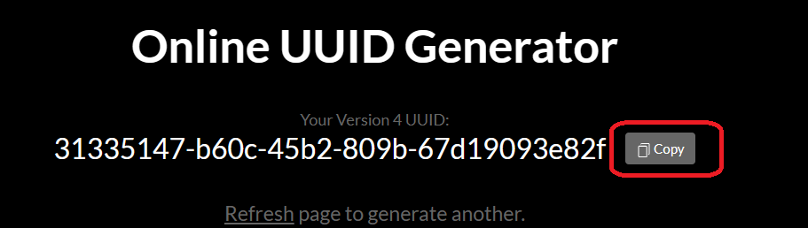
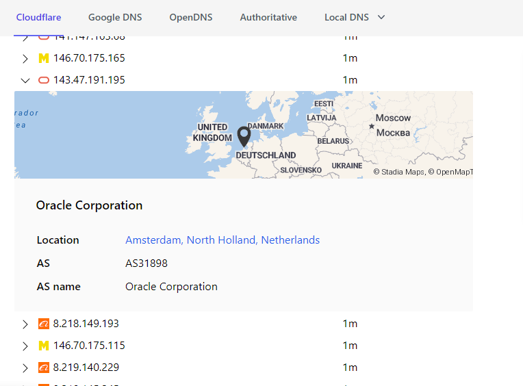

 # مراحل نصب


## نصب به صورت Cloudflare Worker


اولین گام، دانلود کد Worker از آدرس زیر است:

[دانلود کد Worker](https://github.com/bia-pain-bache/BPB-Worker-Panel/releases/tag/v2.2)

سپس فایل را در داشبورد ورکر کلادفلر آپلود کنید. (توجه: به دلیل زیاد شدن کد، استفاده از کپی پیست با گوشی دشوار است. بهتر است تصویر زیر را مشاهده کنید.)


**آپلود فایل Worker (روی منوی باز شده تاچ کنید و نگه دارید)**

 ورکر رو Save and Deploy کنید.

حالا به داشبورد ورکرتان برگردید و این مراحل را دنبال کنید:



بعد از این قسمت وارد صفحه KV بشید:



در قسمت KV، Create a namespace را انتخاب کرده و یک اسم دلخواه وارد کنید، مثلا Test، سپس آن را اضافه کنید.

سپس از منوی سمت چپ به قسمت Workers & Pages بروید، ورکری که ساختید را باز کرده، به قسمت Settings بروید و Variables را انتخاب کنید. در قسمت KV Namespace Bindings، بر روی Add binding کلیک کنید و مطابق تصویر زیر، از کشویی سمت راست آن KV که ساخته بودید را انتخاب کنید (در مثال Test بود). مواردی که حیاتی است: کشویی سمت چپ را با bpb پر کنید، سپس ذخیره و اجرا کنید.




برای مثال، فرض کنید اسم ورکر شما worker-polished-leaf-d022 است. شما می‌توانید Panel را از لینک زیر مشاهده کنید:

[https://worker-polished-leaf-d022...workers.dev/panel](https://worker-polished-leaf-d022...workers.dev/panel)

ابتدا از پایین پنل reset password را بزنید و عوضش کنید، باید حداقل 8 کاراکتر باشه و حداقل یک حرف بزرگ و یک عدد هم توش باشه.


آموزشها و نکات هم که تو آموزش اصلی هست:

[Tutorial Link](configuration_fa.md)

نصب به پایان رسیده و توضیحاتی که در ادامه اومده شاید برای عموم لازم نباشه. !

####  تنظیمات پیشرفته (اختیاری)
شاید تا الان متوجه شده باشید که در مورد تغییر UUID و Proxy IP چیزی نگفتیم. 

**تغییر UUID**
همونطور که میدونید UUID  مثل اسم رمزی میمونه که داخل لینک‌های اشتراک و کانفیگ ها قرار میگیره و شما در صورت نیاز میتونید تغییر بدید. در صورت تغییر این پارامتر اتصال کاربرهای شما قطع میشه  و لازم هست لینک اشتراک و یا کانفیگ ها رو مجددا در اختیارشون قرار بدید. در صورتی که این UUID رو در این مرحله تعریف نکنید هم کد از یک UUID پیشفرض استفاده خواهد کرد.

تو خط 9 یه uuid هست و میتونید تغییرش ندید ولی ترجیحا اینجوری عوضش کنید: تو خط 8 یه آدرس وبسایت گذاشتم این پایین هم لینکش رو گذاشتیم، بازش کنید یه UUID بگیرید و کپی کنید تو خط 9 جای قبلی و تمام. ورکر رو Save and Deploy کنید.

[UUID Generator](https://www.uuidgenerator.net/)




**ثابت کردن Proxy IP**

ما یه مشکلی داریم که این کد به صورت پیشفرض از تعداد زیادی IP Proxy استفاده میکنه که برای هر بار اتصال به سایتای پشت کلادفلر ( شامل بخش وسیعی از وب میشه) به صورت رندوم IP جدیدی انتخاب میکنه و در نتیجه به صورت متناوب IP شما رو به صورت مجازی تغییر پیدا میکنه. این تغییر IP شاید برای برخی مشکل ساز باشه. (معایب و مزایای IP ثابت)


ما یک مشکل داریم که VPN مرتباً برای سایت‌های پشت Cloudflare (بخش وسیعی از وب) تغییر آدرس IP می‌دهد. برای حل این مشکل، به خطوط 11 و 12 کد نگاه کنید. من دو لینک را قرار داده‌ام. آن‌ها را باز کنید و چندین آدرس IP مشخص شده را بررسی کنید. یکی از آن‌ها را انتخاب کرده و آن را در خط 13 قرار دهید.

[Proxy IP](https://www.nslookup.io/domains/cdn.xn--b6gac.eu.org/dns-records/)

[Proxy IP](https://www.nslookup.io/domains/cdn-all.xn--b6gac.eu.org/dns-records/)




متن اول خط 13 به این صورت است:

```javascript
const proxyIPs = ['cdn.xn--b6gac.eu.org', 'cdn-all.xn--b6gac.eu.org', 'edgetunnel.anycast.eu.org'];
```

بعد که خواستید IP رو بذارید این شکلی میشه:
```javascript
const proxyIPs = ['8.218.149.193'];
```

**نکته 1:** فقط حواستون باشه تعداد این IP ها زیاده و ممکنه تعداد زیادیشون از کار افتاده باشن. باید تست کنید تا یه خوبشو سوا کنید.

**نکته 2:** اگر از تک IP استفاده کنید احتمالا بعد یه مدت دوباره از کار میافته و خیلی سایتا باز نمیشن. باید از اول این مراحلو برید.


 ورکر رو Save and Deploy کنید.

 
