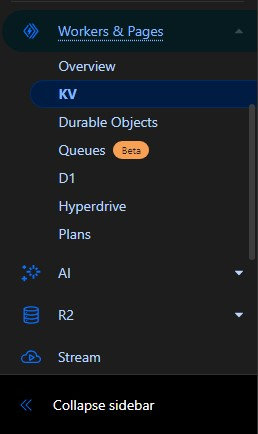

<h1 align="center">نصب از طریق Cloudflare Workers</h1>

خب اول کد Worker رو از [اینجا](https://github.com/bia-pain-bache/BPB-Worker-Panel/releases/latest/download/worker.js) دانلود کنید و ببرید توی داشبورد ورکر کلادفلرو فایل رو آپلود کنید (چون کد خیلی زیاد شده Copy Paste کردن با گوشی خیلی سخت شده، با توجه به عکس زیر آپلود کنید). توی مویایل منوی کناری رو باز کنید و تاح کنید روش نگه دارید و آپلود کنید.

<p align="center">
  
</p>

پنل با UUID و Proxy IP و پسوردهای Trojan پیشفرض خودش کار میکنه و میتونید ادامه بدید، ولی اگر خواستید تغییر بدید به بخش [تنظیمات پیشرفته](#تنظیمات-پیشرفته-اختیاری) برید و برگردید اینجا.

 در نهایت ورکر رو `Save and Deploy` کنید.
حالا از اینجا به داشبورد ورکر برگردید و این مراحل را دنبال کنید:

<p align="center">
  
</p>

از این قسمت وارد صفحه `KV` بشید:

<p align="center">
  
</p>

تو قسمت KV بزنید `Create a namespace` و یه اسم دلخواه وارد کنید مثلا Test و `Add` کنید.

دوباره از منوی سمت چپ به قسمت `Workers & Pages` برید، ورکری که ساختید رو باز کنید، برید به قسمت `Settings` و `Bindings` رو پیدا کنید. `Add` بزنید و `KV Namespace` رو انتخاب کنید،  مطابق تصویر زیر از کشویی پایینی اون KV که ساخته بودید انتخاب کنید (در مثال Test بود). چیزی که مهمه کشویی بالاییه، حتما باید مقدارش رو بذارید `bpb` و `Save` و تمام.

<p align="center">
  
</p>

برای مثال، فرض کنید دامنه‌ی ورکر شما هست worker-polished-leaf-d022.workers.dev، یه `panel/` تهش اضافه کنید و وارد پنل بشید. مثال:

>`https://worker-polished-leaf-d022.workers.dev/panel`

ازتون میخواد پسورد جدید بذارید و لاگین کنید و تمام.
نصب به پایان رسیده و توضیحاتی که در ادامه اومده شاید برای عموم لازم نباشه.
آموزشهای تنظیمات و نکات هم که توی [آموزش اصلی](configuration_fa.md)  هست.
<br><br>
##  تنظیمات پیشرفته (اختیاری)
شاید تا الان متوجه شده باشید که در مورد تغییر UUID و Proxy IP و پسورد Trojan چیزی نگفتیم چون میتونید از پیشفرض خود پنل استفاده کنید. اما برای تغییرشون میتونید مراحل زیر رو دنبال کنید، توصیه میشه حداقل UUID و پسوردهای Trojan رو تغییر بدید. 

### 1- تغییر UUID
همونطور که میدونید UUID  مثل اسم رمزی میمونه که داخل لینک‌های اشتراک و کانفیگ ها قرار میگیره و شما در صورت نیاز میتونید تغییر بدید. در صورت تغییر این پارامتر اتصال کاربرهای شما قطع میشه  و لازم هست لینک اشتراک و یا کانفیگ ها رو مجددا در اختیارشون قرار بدید. در صورتی که این UUID رو در این مرحله تعریف نکنید هم کد از یک UUID پیشفرض استفاده خواهد کرد.

تو خط 9 یه UUID هست و میتونید تغییرش ندید ولی ترجیحا اینجوری عوضش کنید: از [اینجا](https://www.uuidgenerator.net/) (تو خط 9 کد هم هست) یه UUID بگیرید و کپی کنید تو خط 10 جای قبلی و تمام. ورکر رو Save and Deploy کنید.


### 2- ثابت کردن Proxy IP

ما یه مشکلی داریم که این کد به صورت پیشفرض از تعداد زیادی IP Proxy استفاده میکنه که برای هر بار اتصال به سایتای پشت کلادفلر ( شامل بخش وسیعی از وب میشه) به صورت رندوم IP جدیدی انتخاب میکنه و در نتیجه به صورت متناوب IP شما تغییر پیدا میکنه. این تغییر IP شاید برای برخی مشکل ساز باشه (مخصوصا تریدرها). برای تغییر Proxy IP از ورژن 2.3.5 به بعد میتونید از طریق خود پنل انجام بدید، به این ترتیب که اعمال میکنید و ساب رو آپدیت میکنید و تمام. اما توصیه میکنم از روشی که در ادامه توضیح دادم استفاده کنید چون:

> [!CAUTION]
> اگر از طریق پنل Proxy IP رو اعمال کنید و اون IP از کار بیافته، باید یه IP جایگزین کنید و ساب رو آپدیت کنید. معنیش اینه که اگر کانفیگ اهدا کرده باشید و Proxy IP رو تغییر بدید دیگه فایده‌ای نداره چون یوزر ساب نداره که کانفیگ رو آپدیت کنه. بنابراین توصیه میشه از این روش فقط برای مصرف شخصی استفاده کنید. اما خوبی روش دوم که در ادامه میگم اینه که از طریق داشبورد کلادفلر انجام میشه و نیازی به آپدیت کردن کانفیگ‌ها نداره.
<br>

این لینک رو باز کنید (داخل کد ورکر خط 12 هم گذاشتم) یه تعدادی IP نشون میده که میتونید کشورشون رو هم چک کنید و یه دونه انتخاب کنید.

>[Proxy IP](https://www.nslookup.io/domains/bpb.yousef.isegaro.com/dns-records/)


<p align="center">
  
</p>

متن اول خط 14 به این صورت است:

```javascript
const proxyIPs= ['bpb.yousef.isegaro.com'];
```

بعد که خواستید IP رو بذارید این شکلی میشه:
```javascript
const proxyIPs = ['8.218.149.193'];
```

ورکر رو `Save and Deploy` کنید.
> [!WARNING]
> فقط حواستون باشه تعداد این IP ها زیاده و ممکنه تعداد زیادیشون از کار افتاده باشن. باید تست کنید تا یه خوبشو سوا کنید.

> [!CAUTION]
> اگر از تک IP استفاده کنید احتمالا بعد یه مدت دوباره از کار میافته و خیلی سایتا باز نمیشن. باید از اول این مراحلو برید.


### 3- پسوردهای Trojan

پروتکل Trojan با پسوردهای پیشفرض خودش کار میکنه ولی با توجه به اینکه تعداد زیادی از این پنل استفاده میکنن، توصیه میکنم حتما این دو تا پسورد عوض بشن. اگر به خط 18 نگاه کنید پسورد پیشفرض bpb-trojan رو میبینید، میتونید یه پسورد دلخواه اینجا بذارید، ولی دقت کنید هر وقت عوضش کنید نیازه که پسورد hash در خط 21 رو هم عوض کنید. به این شکل که پسورد جدید رو میذارید داخل یکی از لینکهای زیر و hash تولید شده رو میذارید خط 21:
- وارد این سایت بشید و پسورد دلخواهتون رو بذارید input خودش قسمت output سریع hash رو بهتون میده.
> https://emn178.github.io/online-tools/sha224.html

- اگر از این استفاده میکنید، پسورد رو میذارید سمت چپ و convert رو میزنید.

> https://www.atatus.com/tools/sha224-to-hash